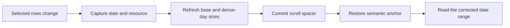
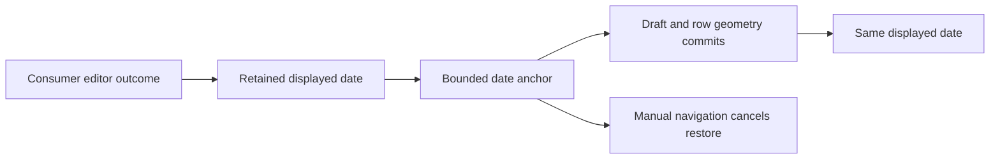

# Branch: `feat/calendar-row-filter-fixes`

1. Preserve horizontal dates when selected rows change.
   1. Capture the date and resource offset before base estimates change. Clear cached estimates and reapply known dense-day measurements.
   2. Hold the semantic render window while the scroll spacer commits. Restore the anchor before paint and publish the corrected virtual range.
   3. Keep missing-resource offsets inside unloaded dates. Defer estimate resets while drafts, explicit restores or pointer gestures own focus.
      Why: Compact calendars must not jump to unrelated dates or repeatedly cancel event reads.
      Files: `useHorizontalDayMeasurement.ts`, `horizontalDataLayoutAnchor.ts`, `useScrollRuntime.ts` and `useHorizontalTimelineFoundation.ts`.

2. Prepare the local 0.6.3 package from latest main.
   1. Base the branch on `origin/main` at `d8f49d293687747f951bce15b15530eae4701e5e`.
   2. Add real-browser regressions for 135-row contraction, expansion, surviving-row offsets, empty selection, idle settling and bounded request ranges.
   3. Update the version, usage guidance, decision 104 and measured payload figures. Retain existing public calendar contracts.
      Why: Onboarding needs one installable package with native geometry correction.
      Files: package manifests, calendar unit/browser fixtures, field-guide payload facts, README files, usage, async flow and the decision ledger.

3. Verify the package and existing interactions.
   1. Pass all 512 unit tests and all 160 Chromium scenarios. Keep 135-row date/request checks and dense create/cancel/participant checks together.
   2. Pass architecture, typecheck, lint, formatting, library/demo builds and packed React 18, React 19, Preact, TypeScript and SSR checks.
   3. Measure 39.80 KiB gzip JavaScript and 1.99 KiB gzip CSS within the existing budgets.
      Why: The row filter must preserve editor restoration and existing runtime compatibility.
      Files: regression tests, package validation scripts, `CHANGELOG.md` and production payload facts.

4. Keep late offscreen data from moving the displayed calendar.
   1. Retain the visible date and row through event-height changes, including updates larger than the old scroll area.
   2. Commit the spacer, restore the captured anchor, and render the corrected range before paint. Do not recapture focus from a clamped offset.
   3. Refresh the resource viewport metrics before paint. Keep native scroll reads frame-coalesced.
   4. Test every painted frame during earlier/later-date growth and participant changes. Test shrinkage and newer navigation while reads are pending.
      Why: Incoming events must not become scroll targets or briefly remove the displayed row.
      Files: `useHorizontalDayMeasurement.ts`, `viewportMetricsStore.ts`, delayed-response fixture, geometry regressions, calendar README, async flow, usage and decision 105.

5. Hold the consumer's editor outcome date through layout changes.
   1. Resolve date-only anchors from registered days. Preserve horizontal scrolling. Retry a missing date when committed geometry changes.
   2. Refresh compact base measurements once after a date restore releases its draft. Retain the bounded session and manual-scroll cancellation.
   3. Keep drag and event/resource restore paths unchanged. Leave Save/Cancel policy in the consumer.
   4. Verify 135-row create/edit completion, distant cancellation, idle settling and manual navigation. Pass 515 unit tests and 166 Chromium scenarios; one existing scroll scenario passes on isolated retry.
   5. Pass architecture, typecheck, lint, formatting, library/demo build, package, Preact and React 19 checks. Measure 40.01 KiB gzip JavaScript and 1.99 KiB gzip CSS.
      Why: Deferred draft geometry must not override the day selected by the editor outcome.
      Files: parent anchor hooks and session, horizontal measurement and navigation, vertical navigation, editor outcome fixtures, geometry tests, usage, production facts and decision 106.

6. Merge the current upstream editor fixes with local viewport preservation.
   1. Merge `origin/main` at `b774e969eab56ca4499a610320df915265968ec6`. Keep the demo's resource-slot open/Cancel restore and hover stability checks.
   2. Keep the active restore date mounted. Retain late-data anchoring, base estimate refresh and date-only parent restores.
   3. Keep editor outcome policy in the consumer. Cancel returns to the opening day. Save retains the day visible when Save was clicked.
   4. Add frame-by-frame browser checks for 3-second responses during rapid wheel reversals, with one and six calendars.
   5. Stabilize popup-layering setup with a fixed clock and completed loading. Exercise editor manual scrolling with a real wheel gesture. Keep both assertions intact.
   6. Preserve concurrent accepted decision identifiers and distinguish their records by full title. Report the combined artifact as 40.28 KiB gzip JavaScript and 1.99 KiB CSS.
   7. Pass 515 unit tests, all 175 Chromium scenarios and 348 onboarding calendar tests. Pass formatting, architecture, typecheck, lint, builds and packed React/Preact/TypeScript/SSR checks. Verify the installed consumer runtime against the rebuilt files.
      Why: Upstream editor fixes and local late-response fixes address different causes of viewport movement.
      Files: horizontal foundation, scroll runtime, demo editor hooks, delayed-load browser tests, usage, decisions and production facts.

7. Keep filtered-row requests tied to the viewport.
   1. Separate committed viewport dates from rendered overscan and editor pins. Coalesce rapid scroll changes for 100 ms.
   2. Add optional `loadCalendarIds` for stable provider coverage while display rows change. Retain adjacent pending edge reads without requesting extra dates.
   3. Preserve date/row anchoring, generation guards and bounded retries. Add real-browser checks for fixed filtered rows, an empty selection and fast reversals.
   4. Retain the load window during drafts and closing transitions. Apply an existing Cancel restore before paint. Preserve the saved date during row-count resizing.
      Why: Row filters must not produce far-away request windows or repeated cancellation loops.
      Files: viewport load-date hook, scroll runtime, view loaders, public props, unit/browser coverage and loading documentation.
