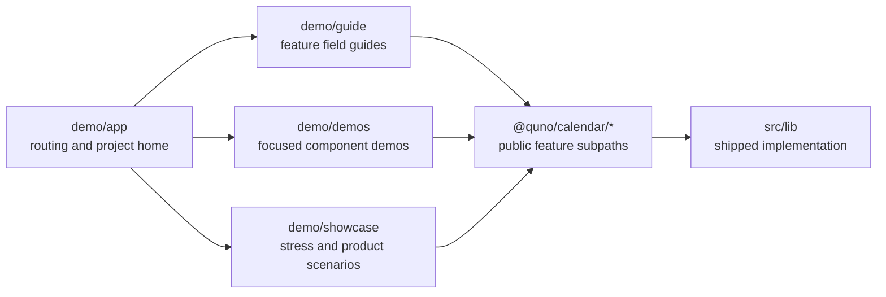

# Demo Application

The demo is intentionally outside `src/`. Everything under `src/lib` is reusable package code; everything here is application code used to explain or stress the package.

## Responsibilities

| Directory                | Purpose                                                                 | Optimization target            |
| ------------------------ | ----------------------------------------------------------------------- | ------------------------------ |
| [`app`](./app)           | Vite entrypoint, project home, route ownership, and application styling | Discoverability                |
| [`guide`](./guide)       | Dedicated feature guides composed from focused public-contract exhibits | Copyability and teaching       |
| [`demos`](./demos)       | Focused date range and natural-input component demos                    | Immediate exploration          |
| [`showcase`](./showcase) | Dense timeline data, product-like controls, and visual variants         | Stress and exploratory testing |

The demo may use development dependencies and mock transports. Library code must never import from `demo/`.
