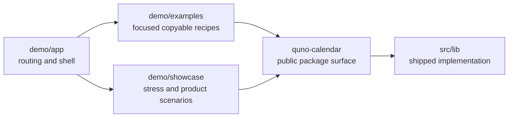

# Demo Application

The demo is intentionally outside `src/`. Everything under `src/lib` is reusable package code; everything here is application code used to explain or stress the package.

## Responsibilities

| Directory                | Purpose                                                                      | Optimization target            |
| ------------------------ | ---------------------------------------------------------------------------- | ------------------------------ |
| [`app`](./app)           | Vite entrypoint, route registry, example navigation, and application styling | Discoverability                |
| [`examples`](./examples) | Small integrations that demonstrate one public contract at a time            | Copyability and teaching       |
| [`showcase`](./showcase) | Dense datasets, product-like controls, external forms, and visual variants   | Stress and exploratory testing |

The demo may use development dependencies and mock transports. Library code must never import from `demo/`.
