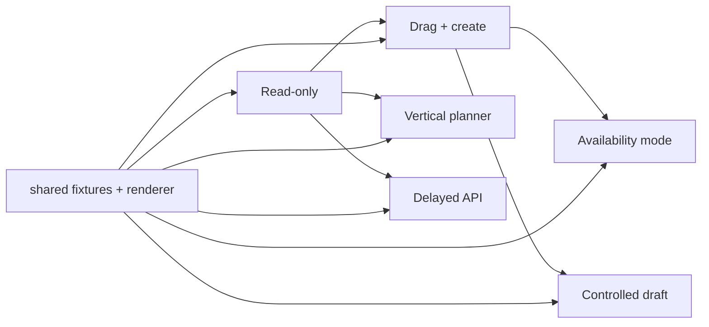

# Calendar Examples

Examples are ordered from the smallest integration to parent-controlled and asynchronous workflows. Each recipe has its own directory, documentation, and one primary component.

| Recipe                                           | Route                        | Learn this first                           | Primary source                                                                  |
| ------------------------------------------------ | ---------------------------- | ------------------------------------------ | ------------------------------------------------------------------------------- |
| [Read-only](./read-only/README.md)               | `/examples/read-only`        | Minimal inputs and external rendering      | [`ReadOnlyCalendar.tsx`](./read-only/ReadOnlyCalendar.tsx)                      |
| [Drag and create](./drag-create/README.md)       | `/examples/drag-create`      | Parent-owned event mutation                | [`DragCreateCalendar.tsx`](./drag-create/DragCreateCalendar.tsx)                |
| [Vertical planner](./vertical-planner/README.md) | `/examples/vertical-planner` | Orientation and column sizing              | [`VerticalPlanner.tsx`](./vertical-planner/VerticalPlanner.tsx)                 |
| [Availability](./availability/README.md)         | `/examples/availability`     | Availability interaction mode              | [`AvailabilityEditor.tsx`](./availability/AvailabilityEditor.tsx)               |
| [Controlled draft](./controlled-draft/README.md) | `/examples/controlled-draft` | External create/edit form ownership        | [`ControlledDraftCalendar.tsx`](./controlled-draft/ControlledDraftCalendar.tsx) |
| [Delayed API](./async-api/README.md)             | `/examples/async-api`        | Non-blocking loading and late-layout focus | [`AsyncApiCalendar.tsx`](./async-api/AsyncApiCalendar.tsx)                      |

## Shared support

[`shared/calendarExampleSupport.tsx`](./shared/calendarExampleSupport.tsx) owns the deliberately tiny fixture, range loader, and renderer reused by introductory recipes. [`shared/withSimulatedLatency.ts`](./shared/withSimulatedLatency.ts) is the abort-aware latency adapter used by the delayed recipe. Product-specific state stays inside each recipe.

All recipes import `quno-calendar`, the same public entrypoint a consumer uses. They must not import `src/lib` by relative path.
