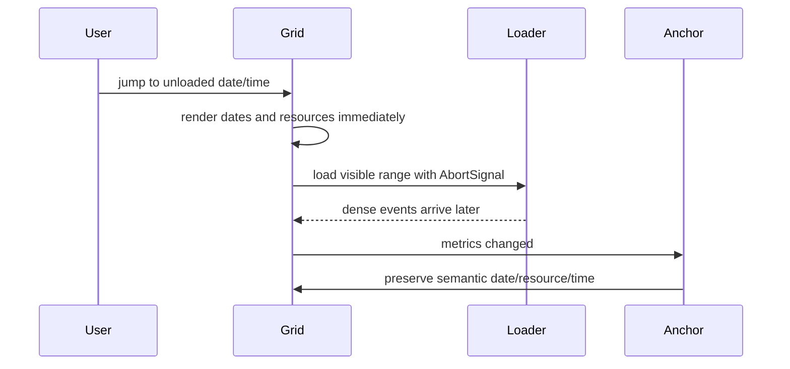

# Delayed Async API

Use this to verify that slow or obsolete event requests never block calendar chrome, scrolling, navigation, or zoom. Late overlap may change row height or column width; semantic anchoring keeps the requested date/resource/time in focus.

- Primary source: [`AsyncApiCalendar.tsx`](./AsyncApiCalendar.tsx)
- Fixture loader: [`asyncExampleData.ts`](./asyncExampleData.ts)
- Latency adapter: [`../shared/withSimulatedLatency.ts`](../shared/withSimulatedLatency.ts)
- Query parameters: `?latency=3000` changes delay; `?view=vertical` changes orientation.
- Detailed runtime flow: [`../../../docs/flows/async-loading-and-layout.md`](../../../docs/flows/async-loading-and-layout.md)
