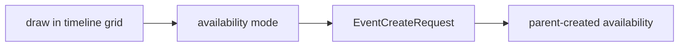

# Availability Editor

Use this when drawing creates availability rather than appointments. The interaction mode changes hit semantics while creation remains parent-owned.

- Primary source: [`AvailabilityEditor.tsx`](./AvailabilityEditor.tsx)
- Public concepts: `interactionMode="availability"`, `onEventCreateRequest`
- Hit-testing remains limited to timeline grid space.
