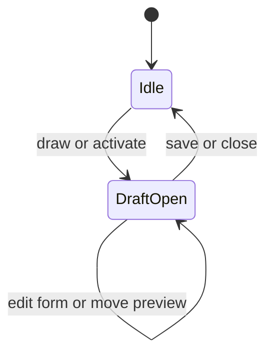

# Controlled Draft

Use this when product UI owns an external create/edit form. The parent controls the draft record; the calendar renders its preview and reports proposed draft moves.

- Primary source: [`ControlledDraftCalendar.tsx`](./ControlledDraftCalendar.tsx)
- Public concepts: `activeDraft`, `onEventDraftRequest`, `onEventActivate`, `onActiveDraftMoveRequest`
- Product form state does not live inside calendar internals.
