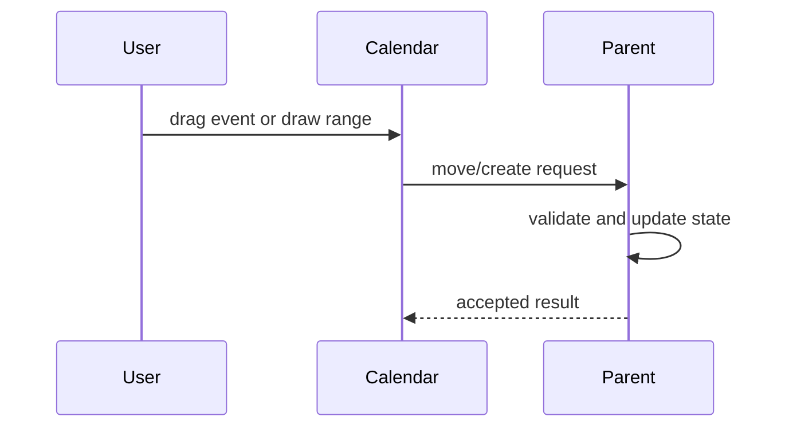

# Drag and Create

Use this when the parent owns event persistence. The calendar proposes moves and drawn ranges; the parent validates them, updates its store, and returns the accepted result.

- Primary source: [`DragCreateCalendar.tsx`](./DragCreateCalendar.tsx)
- Public concepts: `onEventMoveRequest`, `onEventCreateRequest`, `applyEventMove`
- Ownership rule: the calendar proposes; the parent persists.
