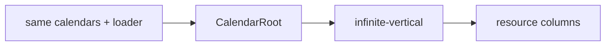

# Vertical Resource Planner

Use this to project the same loader and renderer into resource columns with vertical time. Orientation changes geometry, not the data contract.

- Primary source: [`VerticalPlanner.tsx`](./VerticalPlanner.tsx)
- Public concepts: `view`, `verticalColumnMinWidth`, overlap growth settings
- Compare with: [`../read-only/ReadOnlyCalendar.tsx`](../read-only/ReadOnlyCalendar.tsx)
