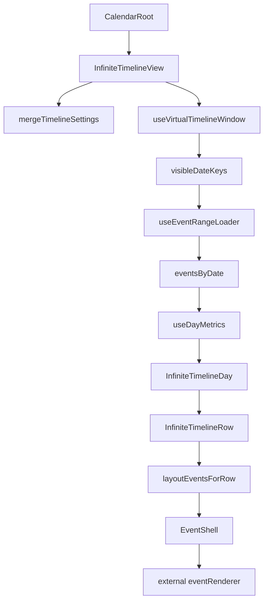
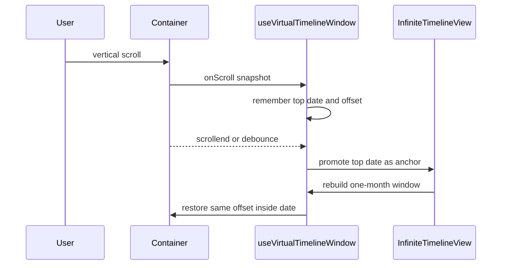
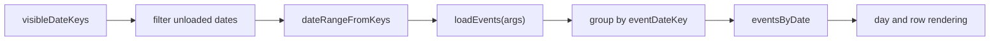
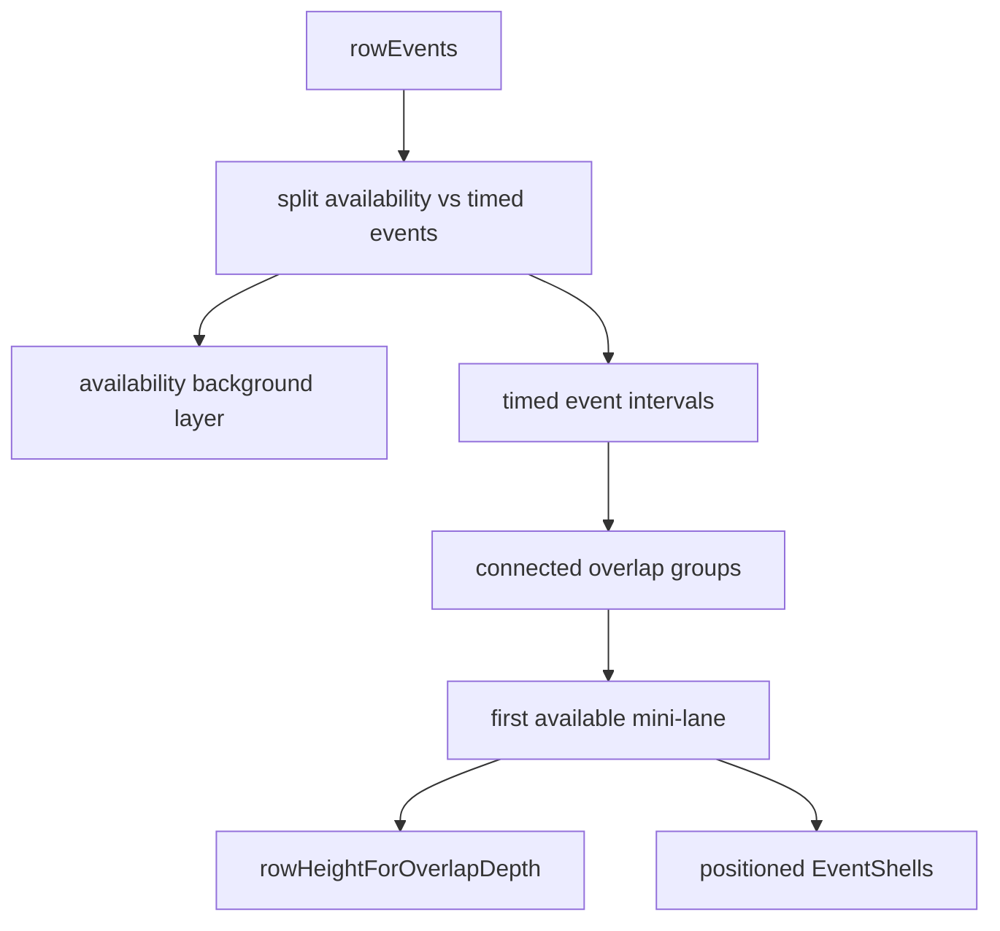
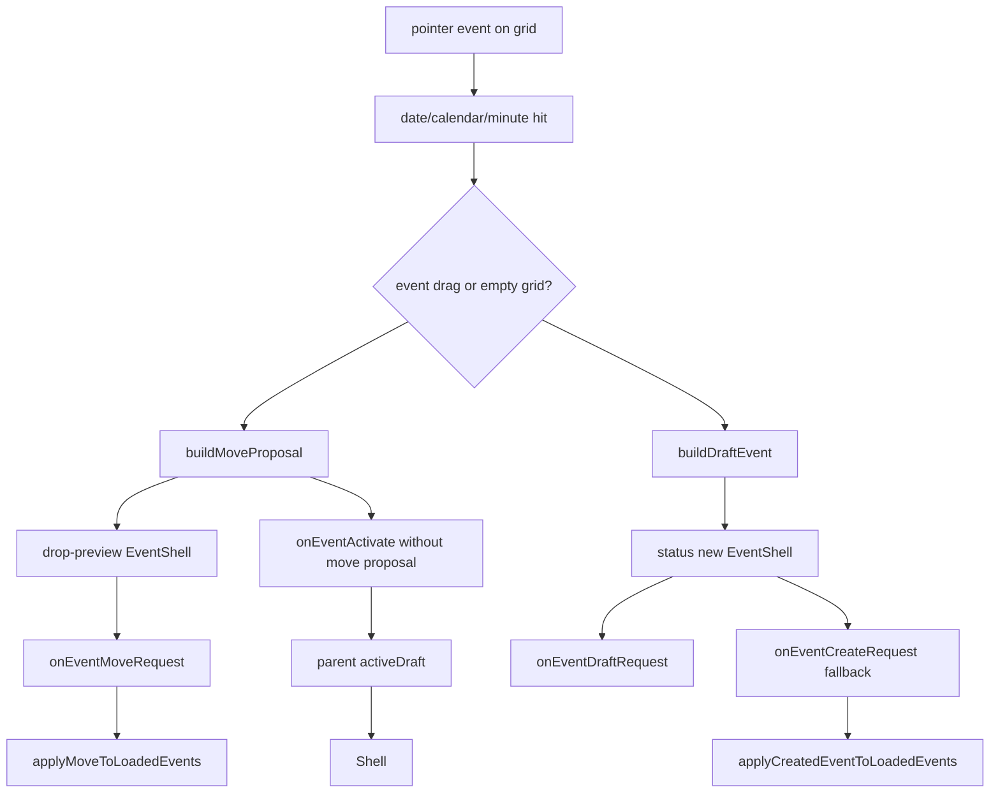

# Architecture and API Notes

Interface vocabulary in this document follows [Interface Taxonomy](./taxonomy.md).

## Component Shape
`CalendarRoot` is the public shell. It accepts shared settings, calendars, data loading, event rendering, and interaction callbacks. It supports `view="infinite-horizontal"` for the original time-horizontal timeline and `view="infinite-vertical"` for the calendar-column timeline. The legacy `view="infinite"` remains an alias for `infinite-horizontal`.

`InfiniteTimelineView` owns horizontal scroll geometry, virtual day rendering, and row hit-testing. `InfiniteVerticalTimelineView` owns vertical scroll geometry, vertical hit-testing, and date/calendar column sizing. Shared pointer interaction state for drag/drop, drawn creation, event activation, and controlled active-draft dragging lives in `useTimelineInteractions`, so both orientations follow the same gesture contract. The views do not persist event changes. Parent code owns accepted data updates and may also own a controlled `activeDraft` for external create/edit popups.

`InfiniteVerticalTimelineView` shares the same public contracts, bounded date virtualization, async loading, renderer contract, and parent-validated interaction callbacks. It swaps the projection so dates and hours flow vertically while calendars render as horizontal columns.

The infinite view also exposes an imperative navigation handle with `scrollToDate(dateKey)`, `scrollToDateTime(dateKey, time)`, and `scrollToToday()`. This keeps date/time navigation reusable while preserving internal virtualization details. Date navigation scrolls immediately even when the requested date is already the current virtual window anchor, so parent-owned popup edits can refocus an active draft after the user has scrolled elsewhere inside the same bounded window.

The active editing layer is selected with `interactionMode`. In `events` mode, appointments are active and availability is a pointer-transparent background. In `availability` mode, availability blocks are active and draggable/creatable while appointments become pointer-transparent background context.

External create/edit UI stays outside the reusable calendar. The parent can pass `activeDraft` to render one controlled create or edit preview. Create drafts render as `status="new"`. Edit drafts visually replace the loaded source event identified by `sourceEventId ?? event.id`, so unsaved popup edits update the calendar without mutating loaded data.

The infinite view is now decomposed into focused modules:
- `src/lib/core`: public shell and API types.
- `src/lib/data`: event membership and accepted-move helpers.
- `src/lib/date`: virtual date sequencing and excluded weekday logic.
- `src/lib/time`: timeline pixel/time conversion.
- `src/lib/layout`: overlap lane assignment and row-height math.
- `src/lib/interaction`: pointer hit-test and draft/move proposal builders.
- `src/lib/infinite`: the infinite view coordinator.
- `src/lib/infinite/hooks`: async loading, virtual scroll window, day metrics, and shared timeline interaction state.
- `src/lib/infinite/components`: sticky header, horizontal day/row render layers, vertical day render layer, and event shell render layers.
- `src/lib/infinite/utils`: infinite-view constants and local pure helpers.
- `src/lib/infinite/InfiniteTimelineView.css`: reusable calendar shell, grid, sticky-label, marker, and event-shell styles imported by the infinite view.
- `src/App.css`, `src/demo/DefaultDemo.tsx`, `src/demo/useExternalEventDrafts.ts`, `src/demo/ExternalEventPopup.tsx`, `src/demo/DemoEventCard.css`, and `src/demo/demo*/`: demo-only app chrome, external popup orchestration, route variants, and renderer styles.

The demo app composes `CalendarRoot` through separate route components. `/` keeps the original PoC controls and renderer, while `/demo1`, `/demo2`, and `/demo3` each own their setup, controls, settings, app chrome, and `eventRenderer` styles inside their folder. Each variant keeps live controls for view orientation, zoom, date navigation, and interaction mode rather than hardcoding a static preview. The variants intentionally share the deterministic event generator but avoid a shared demo shell, demonstrating that compact horizontal boards, wide vertical planners, and availability-first schedules use the same reusable calendar surface without branching inside the library.

## Core API
```tsx
<CalendarRoot
  calendars={calendars}
  selectedCalendarIds={selectedCalendarIds}
  loadEvents={loadEvents}
  eventRenderer={EventCard}
  activeDraft={activeDraft}
  onEventMoveRequest={handleMove}
  onEventCreateRequest={handleCreate}
  onEventDraftRequest={openExternalCreatePopup}
  onEventActivate={openExternalEditPopup}
  onActiveDraftMoveRequest={updateExternalDraftFromDrag}
  interactionMode="events"
  settings={{
    startHour: 8,
    endHour: 18,
    zoom: 1.2,
    snapMinutes: 15,
    excludedWeekdays: [0, 6]
  }}
/>
```

## Rendering Definition
The infinite timeline renders a two-dimensional projection of dates, calendars, and time:
- The vertical axis is an included-date sequence. Excluded weekdays are removed from the sequence.
- Each visible date owns one row per selected calendar.
- The horizontal axis is the configured timeline window, converted with `minuteToX`.
- Persisted events, availability blocks, drag previews, and creation drafts all render through the same external `eventRenderer`.
- Calendar geometry lives in `EventShell`; product event visuals live in the external renderer.

The infinite vertical view uses the same included-date sequence but changes the inner day projection:
- Each visible date owns one calendar column per selected calendar.
- The vertical axis inside each date is the configured timeline window, converted with `minuteToY`.
- The horizontal axis is selected calendars, with each column using `settings.verticalColumnMinWidth` as its base minimum.
- Overlapping timed events split into horizontal lanes inside their calendar column. Each column fits up to `settings.verticalColumnOverlapCapacity` parallel lanes at its base width, then grows by `settings.verticalColumnOverlapGrowth` for each additional lane, allowing horizontal scroll.
- Availability blocks, drag previews, and drafts render through the same `EventShell` and external `eventRenderer`.

## Rendering Pipeline


For `view="infinite-vertical"`, `CalendarRoot` delegates to `InfiniteVerticalTimelineView`. The loader, virtual window hook, event shell, interaction proposals, and renderer contract remain shared; the layout step uses vertical column geometry instead of horizontal row geometry.

### Virtual Scroll Window
The infinite view computes visible date keys from the virtual scroll position.

Vertical virtualization is bounded around the current visible anchor date. The scroll spacer range starts one month before the anchor and ends one month after it, but React only mounts the visible day sections plus five day sections of virtual overscan outside the viewport. When vertical scrolling settles, including native scrollbar-thumb drag completion through `scrollend`, the view promotes the current top visible date to the new anchor, rebuilds the month-before/month-after range, and scrolls that date back to the center area of the scrollbar while preserving the pixel offset inside that date. This keeps scrollbar dragging bounded to nearby dates while preserving the infinite-scroll illusion through recentering without a visible content jump.

The top visible date and the pixel offset inside that date are tracked and restored when the selected calendar count changes, because changing row count changes virtual day heights. The vertical view uses the same layout-change path for zoom gestures: it snapshots the visible date before requesting `onZoomChange`, cancels pending scroll-end recenter timers, and restores the proportional time offset after the day height changes instead of restoring the obsolete raw `scrollTop`.



### Async Event Loading
Missing visible dates are requested with `loadEvents({ startDate, endDate, calendarIds })`.

`useEventRangeLoader` owns this async boundary. It computes the smallest missing visible range, tracks loaded/loading date keys, cancels stale generations when the loader or selected calendars change, and stores results by event start date. Rendering components read only `eventsByDate`.



### Row And Event Layout
Events are grouped by date and every matching calendar row, then converted to pixel layout. Events can use `calendarId` for single-row ownership or `calendarIds` for multi-calendar membership such as doctor plus room.

Availability events use `kind: "availability"`. They render as a row-height background layer through the same external `eventRenderer`, but they are excluded from overlap lane calculation and row-height growth. Availability shells are pointer-transparent so draft creation and regular events can render on top.

In availability editing mode, the layer behavior flips: availability shells become pointer-active, regular event shells become inactive background blocks, and drawn drafts are created as `kind: "availability"`.

Overlapping events are laid out with sorted interval partitioning. A connected overlap chain shares one mini-height lane count, and each event uses the first lane whose previous event has ended. Compact rows default to 50px. Overlap depth grows only the affected date/calendar row with the stepped ladder, then clamps the result so every overlap lane has at least 24px. Resting shells are inset 2px from the top and bottom of their mini-lane, so dense event shells stay at least 20px tall and adjacent resting lanes do not touch. On hover, the shell expands to the full calendar row lane height and comes forward above neighboring shells.

Variable day heights use a cheap base estimate in the virtualizer and measured rendered day elements for actual size. This avoids scanning the full virtual date range while still letting individual dense days become taller. New-event drafts render as overlay shells in the target row and are excluded from overlap lane assignment, row-height metrics, and committed row event counts until creation succeeds.



### Vertical Column Layout
The vertical view computes one grid column per selected calendar for each rendered date. Columns fill available width when there is room and start from `settings.verticalColumnMinWidth`. Timed event overlaps use horizontal lanes inside the column. `settings.verticalColumnOverlapCapacity` controls how many parallel lanes fit inside the base width; every additional lane adds `settings.verticalColumnOverlapGrowth` to that date/calendar column. The sticky doctor-name header for the same date uses the same grid template as the body columns, so a locally widened column also widens its title cell. Hovered vertical events use `settings.verticalEventHoverMinHeight` as their readable minimum height.

The day height is `settings.dayHeaderHeight + timelineHeight(settings) + 16`, so `settings.zoom` controls vertical pixels per minute while the first and last visible hours each keep an 8px vertical gutter. Changing zoom resizes virtualized day items and keeps the parent as the source of truth through `onZoomChange`.

### Interaction Flow
Drag/drop and draft drawing use hit-testing against the rendered virtual day item and row-local heights to convert pointer coordinates into date, calendar, and snapped minute.

Creation and move interactions only start from actual timeline row-grid cells. The sticky time scale, day header bands, date labels, and calendar row labels are not hit targets for creating or moving events.

Move requests are previewed locally, then committed only through `onEventMoveRequest`. The request includes the row instance where the drag started and the full proposed calendar membership.

During drag, every visible instance of the original event remains in normal row layout with status `dragging`, while matching `drop-preview` overlays are rendered in every proposed calendar row. This prevents overlap lanes and neighboring cards from resizing before drop while still showing the full multi-calendar move.

Hover expansion is disabled while a drag or draft drawing interaction is active so cards under the pointer do not resize or open beneath the preview/draft. Dragging and draft drawing also clear current text selection and temporarily apply `user-select: none` to the document so browser selection cannot start during pointer movement.

Create requests are rendered as status `new` in a transient draft overlay while the pointer is drawing. On release, the view either calls `onEventDraftRequest` for parent-owned external creation, or falls back to `onEventCreateRequest` for immediate creation. After `onEventCreateRequest` resolves, the view inserts the created event into the loaded visible date cache immediately; if the parent does not return a created event object, the view uses a local copy of the draft. Only committed events participate in row-height and overlap lane recalculation.

Clicking an active event without producing a move proposal calls `onEventActivate({ event, renderedCalendarId })`. Parents use that to copy the loaded event into `activeDraft` and open an external edit popup. While an edit draft is active, render lists filter out the source event and render `activeDraft.event` through the same event shell in its edited date/time/calendar position. The grid does not start new drawn ranges while any `activeDraft` is present; only the controlled draft shell remains draggable. Dragging that shell emits `onActiveDraftMoveRequest`, and the parent updates `activeDraft.event` so popup date/time fields and every rendered participant instance move from the same state. Multi-calendar active drafts keep their `calendarIds` as a block during drag.

Popup code decides whether a draft edit should focus the event or preserve the current screen position. The default demo records the draft's last visible viewport-relative position. Same-date time edits do not scroll when the draft is already visible. Date changes can move the draft to a different virtual day, so they immediately restore the preview to the last seen viewport-relative position on the first edit. If the draft is offscreen, the demo restores it to that last seen position instead of jumping to a fixed date/time offset. Participant filtering, drawn create handoff, save, and cancel also snapshot the draft and restore the replacement, saved, or original event to the relevant viewport-relative position.



### Sticky Headers And Current Time
The time scale is a single CSS-sticky top row. Individual day sections render an absolute non-layout day-header band in the same header slot plus a CSS-sticky transparent date-label header. The gray band stays below the time scale, while the left date label inside the sticky header is promoted above the time scale and row labels. Calendar row labels also stack above horizontally scrolled timeline content. Date labels are sticky on both top and left axes, so horizontal timeline scroll cannot move them out of view and they cover horizontally scrolled time labels with normal CSS painting.

Time labels are left-aligned to their grid line and minute labels render as superscript for readability. The timeline includes a small 8px gutter before the first minute so the first label does not touch the sticky label border. The time-label layer is sticky only to the top and is not clipped by scroll-synchronized JavaScript. Body current-time lines are rendered inside each row grid, and day-header marker segments are rendered in each gray day band. Both sit above calendar grid data and event cards but below sticky date/calendar labels, so the marker stays continuous through the calendar zone without covering labels where the pointed time is not visible. Labels adapt to horizontal density. Below zoom `2`, 15 and 45 minute labels are hidden while 30 minute labels can remain when there is enough room. Above zoom `6`, the expanded time scale switches to 5-minute labels such as `9 5 10 15 ... 55`.

Timeline grid cadence is 15 minutes by default and switches to 5-minute columns once zoom is greater than `6`, so the expanded high-zoom view exposes finer visual timing.

Current-time markers render on every visible day; today is fully opaque and other days are shown at 50% opacity. The demo passes live system time into the calendar. The round pin appears once in the sticky time scale, with a header segment that connects the line to the pin. The pin, day-header marker segments, and body lines use the same natural timeline x-position. The marker is above timeline grid data, day-header bands, and events, while sticky labels remain above the marker.

In the vertical view, each day owns its own CSS-sticky date plus doctor-name header, so headers pin naturally at the top and transition with the scrolling day sections. The date cell and time pane are sticky only on the left axis, and the left pane is 30% narrower than the configured horizontal-view label width. The time pane remains in each day's normal vertical flow, so time labels move at the same vertical pace as events. Vertical hour labels render as `8:00`; minor labels render as minute numbers such as `15` or `30`. The first and last hour labels sit 8px inside the board edges, mirroring the horizontal view's timeline gutter. The current-time marker is a horizontal line across today's calendar columns only, and it renders only when `now` is inside the enabled timeline range.

Vertical date labels use smaller two-line text: month/day on the first line and weekday on the second line.

Calendar cells use one shared 1px gray border token (`--ic-cell-border`) for the shell, date label, calendar labels, time header, timeline grid lines, and row dividers. Shared edges have a single owner so left labels and timeline cells do not create doubled seams during horizontal scroll.

### Zoom Flow
`Shift` + wheel on the calendar viewport requests a zoom change through `onZoomChange`. The parent remains the source of truth for the actual zoom value. The view handles this with a native non-passive capture-phase `wheel` listener so trackpad gestures are cancelled before browser scrolling or page scrolling can occur. The demo exposes zoom as a `0.5-8` slider and the infinite view clamps incoming zoom settings to the same range.

`Shift` + wheel zoom is nearest-node anchored. The view finds the rendered time-grid node closest to the mouse, using the current grid cadence, and keeps that node at its existing screen position while zoom changes. The horizontal view anchors the nearest time node on the x-axis when horizontal overflow allows it. The vertical view anchors the nearest date/time node on the y-axis. Because zoom is parent-controlled from a native event listener, the view flushes the parent zoom update before restoring scroll against the committed layout, avoiding a visible snap from stale geometry.

Zoom changes outside the wheel gesture still preserve the current visible date. In the vertical view, the intra-day scroll offset is scaled from the previous day height to the next day height so zooming in or out keeps the same date anchored instead of carrying an old pixel offset into another virtual day.

## Demo Instrumentation
The demo app reports lightweight rendering stats in the left pane. A throttled `requestAnimationFrame` sampler shows the average redraw frame interval in milliseconds. The same sampler counts currently visible event DOM nodes by querying rendered appointment, availability, and draft shells that intersect the calendar viewport. It also reports the total number of rendered calendar DOM nodes under the reusable calendar shell. The sampler runs in its own sidebar component so stats updates do not re-render the calendar tree. This is intentionally demo-only instrumentation and is not part of the reusable calendar API.

## Event Renderer Contract
The renderer receives an event, a render status, lane information, overlap information, and a style object. It receives no date virtualization or calendar layout internals. If the same event appears in multiple calendar rows, hover status is local to the row instance under the pointer, while drag/drop-preview status is shared across visible instances by event id.

Each renderer is mounted inside a positioned event shell that is also a CSS size container named `calendar-event`. Product renderers can use container queries to decide how their own content responds to short or narrow event allocations.

The demo renderer shows title, subtitle/patient, and a time range line in `H:mm–H:mm` format. Short-height container queries hide the time line first when three lines do not fit, then hide patient text and reduce title size at smaller resting heights. Draft cards with `status="new"` remain fully opaque and keep the time line visible while the user is drawing. Title icons keep a fixed flex slot and compact size so icons such as video remain visible in dense lanes.

The shell also exposes `--event-accent` from `event.color` plus `--event-accent-muted`, a white-muted version of the same accent. The demo uses the accent for a thick card-left border and the muted accent for standard event-card backgrounds, while calendar row labels remain uncolored.

Hover width expansion is CSS-driven by the event shell and applies only to the hovered row instance. The shell exposes `--event-width` and `--event-hover-width`; the hovered shell uses `width: max-content`, `min-width: var(--event-width)`, and a capped max width so cards whose content already fits stay at their base width. Events narrower than 250px can expand up to 250px or the remaining row space; events already wider than 250px receive a wider cap so hover does not shrink them. Hovered event shells take the full calendar row lane height without exceeding it. In the vertical view, hovered timed events instead expand to the full calendar column width and get a minimum height large enough for the demo card's three content lines. Vertical hover still re-hit-tests the underlying unexpanded overlap lanes on every pointer move, so users can move through an expanded card to focus another event it visually covers. The demo renderer reveals its time line on hover without reducing title or patient font sizes and keeps the same vertical text alignment as the normal state. New-event drafts are not width-capped.

Event shells are memoized around event identity, status, and geometry. Drag-end state changes remove the preview and update the moved event without invoking every unchanged external event renderer.

Supported statuses:
- `existing`
- `hovered`
- `dragging`
- `drop-preview`
- `new`
