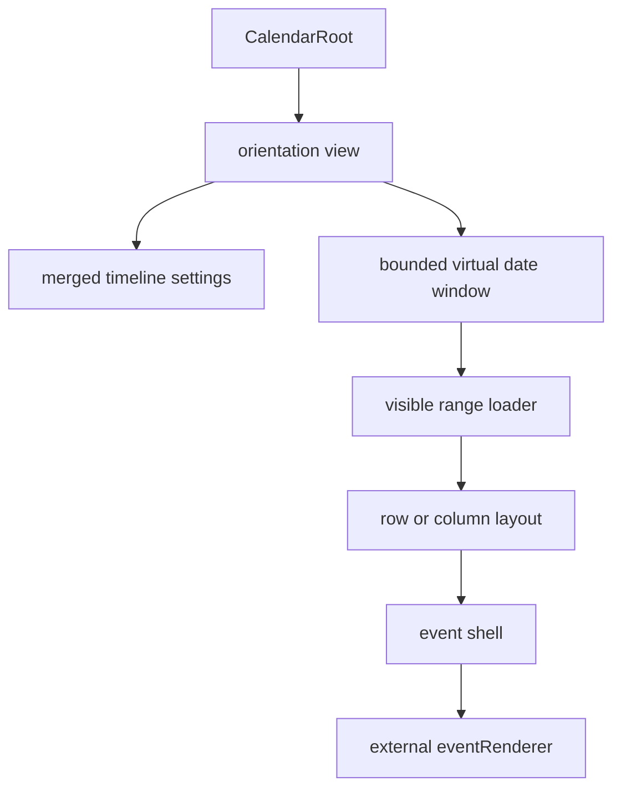

# Architecture Overview

Interface vocabulary follows [Interface Taxonomy](./taxonomy.md).

## Public Surface

`CalendarRoot` is the package entrypoint. It accepts calendars, selected calendar ids, an async visible-range loader, an external event renderer, optional interaction callbacks, controlled settings, and optional surface props such as `className`, `style`, `ariaLabel`, and `initialDateKey`.

Preferred view names are:

- `view="infinite-horizontal"`: dates flow vertically, calendars render as rows, time runs horizontally.
- `view="infinite-vertical"`: dates flow vertically, calendars render as columns, time runs vertically inside each date.

`view="infinite"` remains a compatibility alias for the horizontal view.

Concrete infinite view components are internal implementation details and are not exported from `src/lib/index.ts`.

## Data Flow

The view requests missing visible dates through `loadEvents({ startDate, endDate, calendarIds })`. Loaded buckets are cached by date and can be invalidated with `eventVersion`.

The calendar renders event geometry, but product-specific card content belongs in `eventRenderer`. The renderer receives event data, status, lane metadata, overlap metadata, and a `style` object for full-size card layout.

## Module Boundaries

- `src/lib/core`: public shell and public API types.
- `src/lib/data`: public event membership and move helpers plus internal draft helpers.
- `src/lib/date`, `time`, `layout`, `interaction`: pure date, time, layout, and proposal builders.
- `src/lib/infinite/hooks`: virtual windowing, loading, setup, hit-testing, zoom anchoring, drag lifecycle, draft lifecycle, and shared interaction coordination.
- `src/lib/infinite/components`: render-only day, row, column, header, and event-shell components.
- `src/lib/infinite/styles`: reusable calendar CSS split by shell, horizontal layout, event shells, and vertical layout.
- `src/demo` and `src/examples`: demo application and public usage recipes; neither is part of the package API.

## Virtualization

The timeline keeps a bounded date window around the visible anchor date. It mounts only the visible date sections plus overscan, then recenters after scroll idle while preserving the pixel offset inside the top visible date. This keeps the scrollbar usable while preserving the infinite-scroll illusion.

Both orientations share this date window. Horizontal mode measures variable day height from row overlap density. Vertical mode uses zoom-driven day height and column width growth for dense overlaps.

## Interactions

Pointer hit-testing is limited to timeline grid space, not sticky labels or headers. Shared interaction coordination delegates to focused drag and draft lifecycle hooks:

- Drag/drop previews call `onEventMoveRequest` and update the visible cache only after acceptance.
- Drawn ranges call `onEventDraftRequest` for parent-owned create flows, or `onEventCreateRequest` for immediate create flows.
- Click activation calls `onEventActivate`.
- Controlled active drafts use `activeDraft` plus `onActiveDraftMoveRequest`.

Multi-calendar events render once per matching selected calendar. Hover focus is local to the rendered row or column instance; drag and drop-preview status is keyed by event id across all visible instances.

## Styling

Reusable styles are imported by the library and emitted as `quno-calendar/styles.css` in the package build. Consumers should import that stylesheet once, then style their own event card renderer independently. Event shells expose CSS variables such as `--event-accent`, `--event-accent-muted`, `--event-width`, and `--event-hover-width`.
