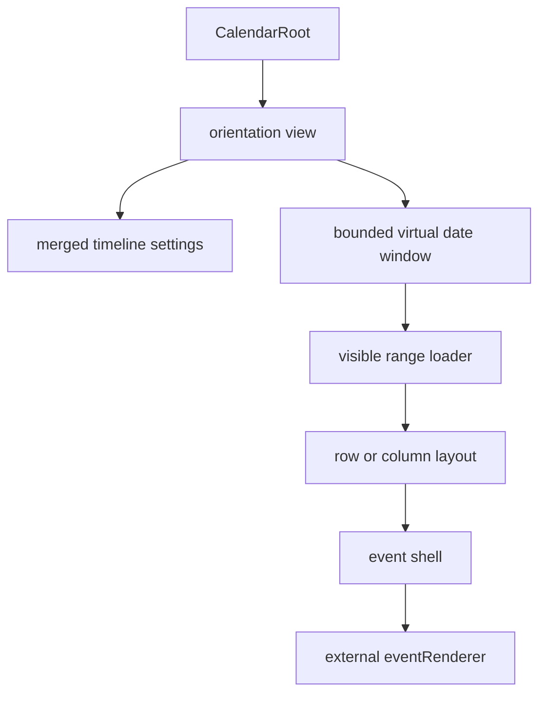

# Architecture Overview

Interface vocabulary follows [Interface Taxonomy](./taxonomy.md).

## Public Surface

`CalendarRoot` is the package entrypoint. It accepts calendars, selected calendar ids, an async visible-range loader, an external event renderer, optional interaction callbacks, controlled settings, and optional surface props such as `className`, `style`, `ariaLabel`, and `initialDateKey`.

Preferred view names are:

- `view="infinite-horizontal"`: dates flow vertically, calendars render as rows, time runs horizontally.
- `view="infinite-vertical"`: dates flow vertically, calendars render as columns, time runs vertically inside each date.

`view="infinite"` remains a compatibility alias for the horizontal view.

Concrete infinite view components are internal implementation details and are not exported from `src/lib/index.ts`.

## Data Flow

The view requests missing visible dates through `loadEvents({ startDate, endDate, calendarIds })`. Loaded buckets are cached by date and can be invalidated with `eventVersion`.

Changing selected calendar ids invalidates in-flight range requests and schedules a refetch, but it does not immediately clear the rendered event cache. The previous cache bridges the filter change so rows do not blank for a frame while the new request resolves; dataset or loader identity changes still clear the cache.

The default demo keeps the package contract unchanged but widens its own range-loader requests to the full selected calendar set while an external create/edit draft filters visible rows. This keeps hidden participant rows warm in the loaded cache so cancelling the popup can expand rows with content already available.

The calendar renders event geometry, but product-specific card content belongs in `eventRenderer`. The renderer receives event data, status, lane metadata, overlap metadata, and a `style` object for full-size card layout.

## Module Boundaries

- `src/lib/core`: public shell and public API types.
- `src/lib/data`: public event membership and move helpers plus internal draft helpers.
- `src/lib/date`, `time`, `layout`, `interaction`: pure date, time, layout, and proposal builders.
- `src/lib/infinite/hooks`: virtual windowing, loading, setup, hit-testing, zoom anchoring, drag lifecycle, draft lifecycle, and shared interaction coordination.
- `src/lib/infinite/components`: render-only day, row, column, header, and event-shell components.
- `src/lib/infinite/styles`: reusable calendar CSS split by shell, horizontal layout, event shells, and vertical layout.
- `src/demo` and `src/examples`: demo application and public usage recipes; neither is part of the package API.

## Virtualization

The timeline keeps a bounded date window around the visible anchor date. It mounts only the visible date sections plus overscan, then recenters after scroll idle while preserving the pixel offset inside the top visible date. Scroll handling schedules the idle recenter even if the virtualizer has not mounted the newly scrolled-to items yet; the delayed snapshot lets the scrollbar reset after large wheel, thumb, or programmatic jumps. This keeps the scrollbar usable while preserving the infinite-scroll illusion.

Both orientations share this date window. Horizontal mode measures variable day height from row overlap density. Vertical mode uses zoom-driven day height and column width growth for dense overlaps.

## Interactions

Pointer hit-testing is limited to timeline grid space, not sticky labels or headers. Shared interaction coordination delegates to focused drag and draft lifecycle hooks:

- Drag/drop previews call `onEventMoveRequest` and update the visible cache only after acceptance. Parent demos also update their source event arrays without bumping `eventVersion`, because a move proposal already contains enough information for the calendar to patch loaded visible buckets without a full range reload.
- Drawn ranges call `onEventDraftRequest` for parent-owned create flows, or `onEventCreateRequest` for immediate create flows.
- Click activation calls `onEventActivate`.
- Controlled active drafts use `activeDraft` plus `onActiveDraftMoveRequest`. When a parent closes a form, it can call `releaseActiveDraft({ animation: "fade-out" })` before clearing `activeDraft` so the calendar retains the last draft shell briefly as a visual anchor.
- Parent create/edit surfaces can preserve a rendered event or calendar slot with `captureViewportAnchor`, `restoreViewportAnchor`, and `cancelViewportAnchorRestore` on the `CalendarRoot` imperative handle. Exact restore corrections can use an offscreen matching event element when layout changes moved it out of view; date/time navigation fallback remains separately controllable. The anchor implementation is library-owned so consumers do not need to query calendar DOM nodes or compute orientation-specific row/column coordinates.

Multi-calendar events render once per matching selected calendar. Hover focus is local to the rendered row or column instance; drag and drop-preview status is keyed by event id across all visible instances.

When active-draft participant filtering temporarily removes every selected calendar, the view keeps the last non-empty draft layout mounted as hidden, inert placeholder rows or columns. The selected ids remain empty for event loading and hit-testing, but the placeholders preserve draft geometry until a participant is selected again or the draft closes.

`Shift` + wheel zoom uses a native capture listener so zoom gestures do not scroll the calendar or page. Each gesture burst chooses one focused time-grid node and reuses it for subsequent wheel ticks, then captures a brief non-extending tail of follow-up wheel events after the Shift key is released so immediate trackpad momentum does not become calendar scroll.

## Styling

Reusable styles are imported by the library and emitted as `quno-calendar/styles.css` in the package build. Consumers should import that stylesheet once, then style their own event card renderer independently. Event shells expose CSS variables such as `--event-accent`, `--event-accent-muted`, `--event-width`, and `--event-hover-width`.
