# Calendar V2 Architecture

The calendar is a reusable rendering library first and a demo application second. Interface vocabulary follows the [Interface Taxonomy](./taxonomy.md); the execution checklist lives in [`plan-v2.md`](../plan-v2.md).

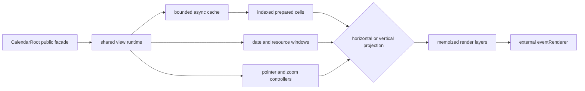

The central performance rule is simple: network work can add or refresh event shells, but it never owns the grid. Dates, resources, scrolling, sticky labels, zoom, hit-testing, and drafts render from settings and the last cache snapshot without awaiting `loadEvents`.

For local development, the demo wraps its fixture range loader with a Vite-only `POST /api/demo-events` mock transport. It exists to make latency, cancellation, and concurrent requests observable in browser tooling; it is not part of the package or runtime dependency graph.

## Runtime Flow Atlas

The overview below defines ownership and dependency direction. Concrete trigger-to-render stories are decomposed into focused guides so each async boundary, correction, and cancellation path can be followed independently.

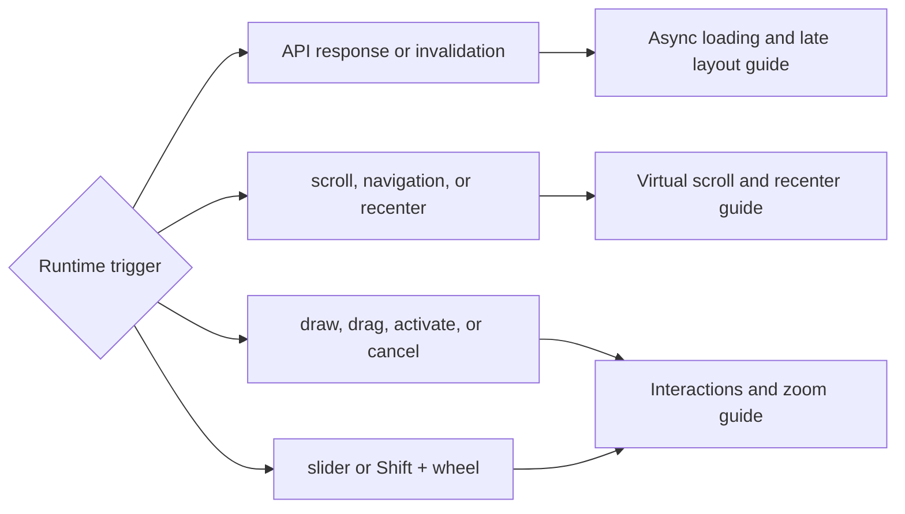

- [Flow guide and anchor taxonomy](./flows/README.md)
- [Async loading, cache commits, and late metric focus](./flows/async-loading-and-layout.md)
- [Virtual scrolling, navigation, measurement, and recentering](./flows/virtual-scroll-and-recenter.md)
- [Pointer interactions, mutation outcomes, and zoom subflows](./flows/interactions-and-zoom.md)

## Public Surface

`CalendarRoot` remains the package entrypoint. It accepts calendars, selected calendar ids, a range loader, an optional `eventPrefetchPolicy`, an external renderer, controlled settings, interaction callbacks, and an optional imperative ref.

- `view="infinite-horizontal"`: dates flow down, calendars are rows, time runs left-to-right.
- `view="infinite-vertical"`: dates flow down, calendars are columns, time runs top-to-bottom.
- `view="infinite"`: compatibility alias for the horizontal view.

`LoadEventsArgs` includes `signal?: AbortSignal`; existing loaders remain valid and cancellation-aware loaders can stop obsolete requests early. `eventPrefetchPolicy` receives the rendered date keys and selected calendar ids and returns `{ beforeDays, afterDays }`. The exported `defaultEventPrefetchPolicy` grows the buffer with the square root of the rendered-day count, avoiding a fixed date constant or linear request growth.

## Dependency Direction

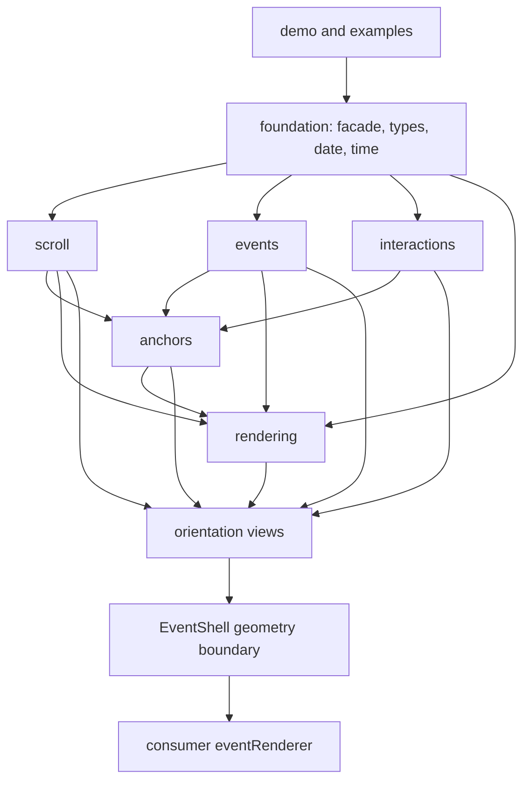

Feature domains do not import views or demo code. Scroll publishes visible positions; events decides what to prefetch. Anchors translate semantic focus using scroll and event geometry without becoming part of either engine. Product card markup stays outside the library internals: rendering positions `EventShell`, then calls `eventRenderer` with event, status, lane, overlap, and full-size style data.

Primary ownership folders are:

- `src/lib/core`, `date`, `time`, and `data`: public facade and foundation primitives.
- `src/lib/infinite/scroll`: bounded date windows, visible position, settlement, navigation, and resource windows.
- `src/lib/infinite/events`: loading, cache, indexing, overlap layout, and metrics.
- `src/lib/infinite/anchors`: parent, late-data, and zoom visual-focus restoration.
- `src/lib/infinite/interactions`: pointer, hit-testing, drag, draft, and wheel-zoom state.
- `src/lib/infinite/rendering`: shared/orientation DOM layers, geometry, and styles.
- `src/lib/infinite/views`: horizontal and vertical composition roots.
- `demo/app`: application entrypoint, route catalog, and recipe navigation.
- `demo/examples`: one documented, focused public-API recipe per directory.
- `demo/showcase`: application-only presets, dense stress data, and product-style interactions.

[`docs/domains`](./domains/README.md) documents every library ownership contract and source file. [`docs/flows`](./flows/README.md) documents execution order. [`demo/examples`](../demo/examples/README.md) documents consumer recipes. Source headers link back to their owning documentation, and `check:architecture` verifies domain maps, dependency direction, a library-only `src/`, and example documentation backlinks.

## Async Event Loading

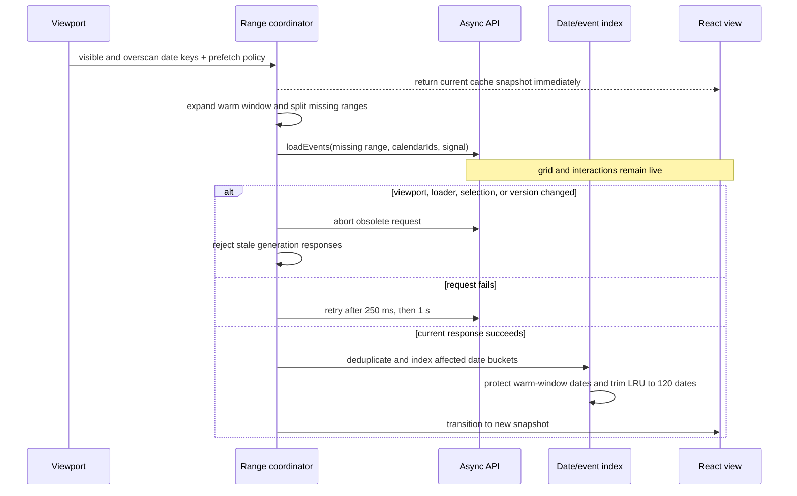

### Unloaded Date To Late Height Commit

Navigation never waits for event data. The grid first paints compact rows for the requested date. If the accepted response later introduces dense overlaps, the calendar captures a grid-owned data-layout anchor, resizes only affected dates, and translates that anchor through the new row prefix extents before paint.

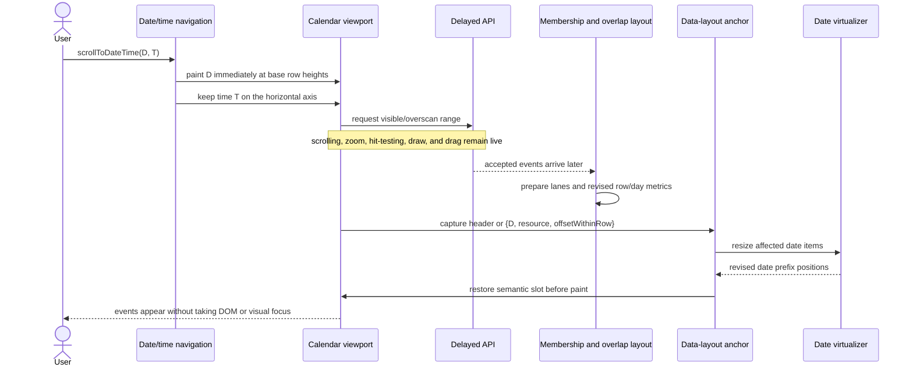

The resulting focus contract is explicit:

| View state before response                   | Position preserved after response                                                  |
| -------------------------------------------- | ---------------------------------------------------------------------------------- |
| Exact `scrollToDate(D)`                      | D's date header; dense rows grow downward.                                         |
| `scrollToDateTime(D, T)`                     | The same date policy vertically and time T horizontally.                           |
| Viewport partway inside resource R on date D | `{ D, R, offsetWithinRow }`; growth above R is compensated.                        |
| Anchored resource removed by another change  | Captured date-local fallback offset, clamped inside D.                             |
| Vertical orientation receives dense overlaps | Date/time Y stays fixed; overlap changes column width rather than vertical height. |

The anchor targets stable grid semantics, never a newly arriving event. The full request, failure, transaction, orientation, and invalidation subflows are in [Async Loading And Layout](./flows/async-loading-and-layout.md).

Important invariants:

- A refresh invalidates loaded-date knowledge, not the rendered cache, so delayed requests do not blank events.
- Abort signals are advisory; generation checks also protect against loaders that ignore cancellation.
- Event ids are deduplicated globally inside cached buckets.
- Moves and visible commits use the event-id index to patch only source/destination buckets.
- Appearance timers are independent per event.
- Empty or failed requests do not change grid geometry.

## Prepared Cell Pipeline

Each revised date is indexed by calendar membership in one pass. Each date/calendar cell separates availability from timed events and prepares overlap lanes with a deterministic heap-based `O(n log n)` algorithm.

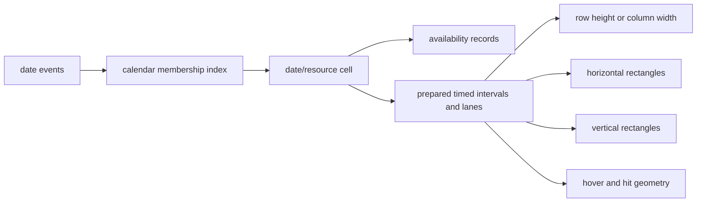

Late data produces a bounded measurement feedback loop; it does not restart the whole calendar:

```mermaid
flowchart LR
  Response["accepted date buckets"] --> Membership["membership index"]
  Membership --> Lanes["prepared overlap lanes"]
  Lanes --> RowMetrics["affected row heights"]
  RowMetrics --> DayMetrics["affected date heights"]
  DayMetrics --> Capture["capture visible semantic slot"]
  Capture --> Resize["resize affected virtual dates"]
  Resize --> Translate["translate date/resource/local offset"]
  Translate --> Paint["paint event shells in stable viewport"]
```

Sizing and rendering reuse the same prepared cell. Availability remains a full-cell background layer and never increases overlap metrics. Draft and drop-preview layers are overlays and do not perturb committed layout.

## Date And Resource Virtualization

The date scrollbar represents a bounded month-before/month-after window. Only viewport dates plus five date sections of overscan on each side are mounted. When scrolling settles, the top visible date becomes the next window anchor while its exact intra-day pixel offset is preserved.

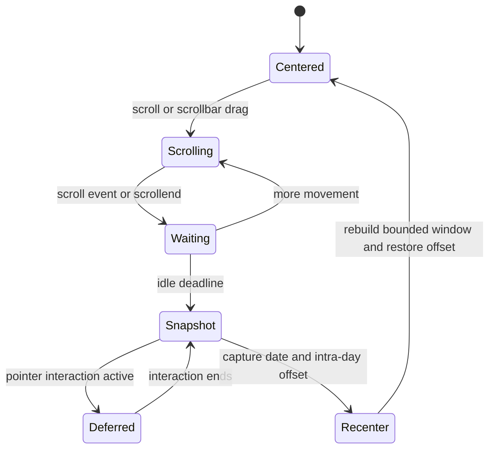

The cross axis has its own resource window:

- Horizontal dates mount only intersecting calendar rows plus two rows of overscan on either side.
- Vertical dates mount only intersecting columns plus two columns of overscan on either side.
- Prefix extents preserve the full row/column spacer geometry; skipped resources never compact the layout.
- Active draft, drop-preview, and active viewport-restore target resources are pinned even when outside the ordinary cross-axis window. Event timestamps are mapped through the canonical local-date helper before choosing either a date or resource pin; raw UTC string prefixes never drive calendar membership.

Async event metrics use a separate one-commit data-layout anchor; they do not replace the bounded virtual-window anchor. The concrete scroll-event, idle timer, pending target, window rebuild, and restore sequence is documented in [Virtual Scroll And Recenter](./flows/virtual-scroll-and-recenter.md).

## Pointer And Zoom Runtime

The viewport uses one Pointer Events pathway. Pointer ownership comes from the mounted grid's date and resource metadata, so a just-measured variable row cannot be mistaken for a neighbor when async data changes layout. Resource cells add local hover resolution, while the shared controller owns press, draw, drag, completion, rejection, callback failure, pointer cancellation, and Escape cancellation.

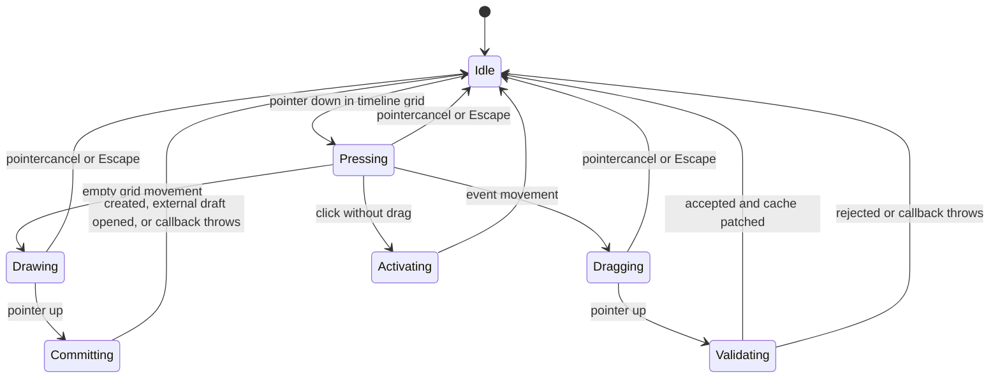

Hit-testing rejects sticky labels and headers. Multi-calendar hover remains local to one rendered resource instance; drag and preview status stays keyed by event id across instances.

Zoom stays controlled by `settings.zoom`. `Shift` + wheel requests `onZoomChange`, keeps the first focused time node for a gesture burst, and restores scroll on an animation frame. Slider or other external horizontal zoom changes preserve the time at the visible grid center in a layout effect before paint after the user has scrolled horizontally; at the timeline origin, they preserve the left edge instead. The wheel path suppresses that generic correction and retains its pointer-specific anchor. Horizontal rendering may apply a viewport-fill zoom floor without mutating the parent-owned value.

## Render Layers

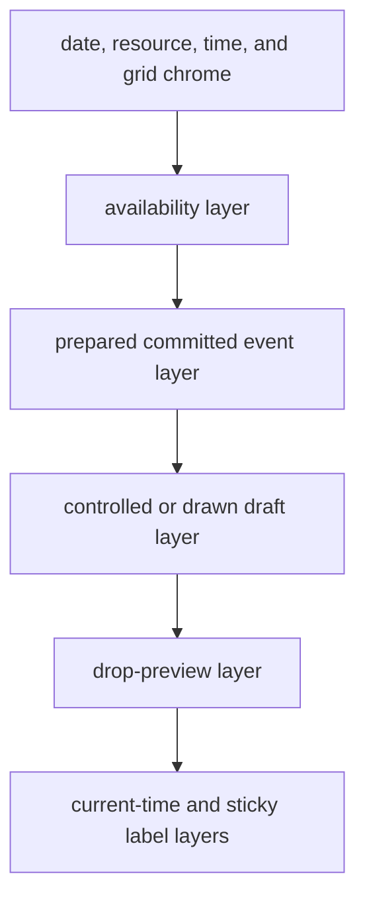

Layers share prepared geometry but have separate interaction rules. `EventShell` is memoized and owns position, z-index, state classes, CSS variables, and geometry registration. Its product-card child is memoized separately, so zoom can update shell coordinates without reinvoking the external renderer. Membership indexes, prepared lanes, row metrics, and column metrics likewise exclude zoom from their memo dependencies because zoom changes projection pixels rather than event relationships.

## Viewport Anchoring

Every mounted day, resource, and event instance registers with an instance-scoped geometry registry. Anchoring never searches the document with global selectors. Event unregisters carry the element they previously owned, so an old date instance unmounting cannot delete a replacement event that already registered under the same event/calendar key.

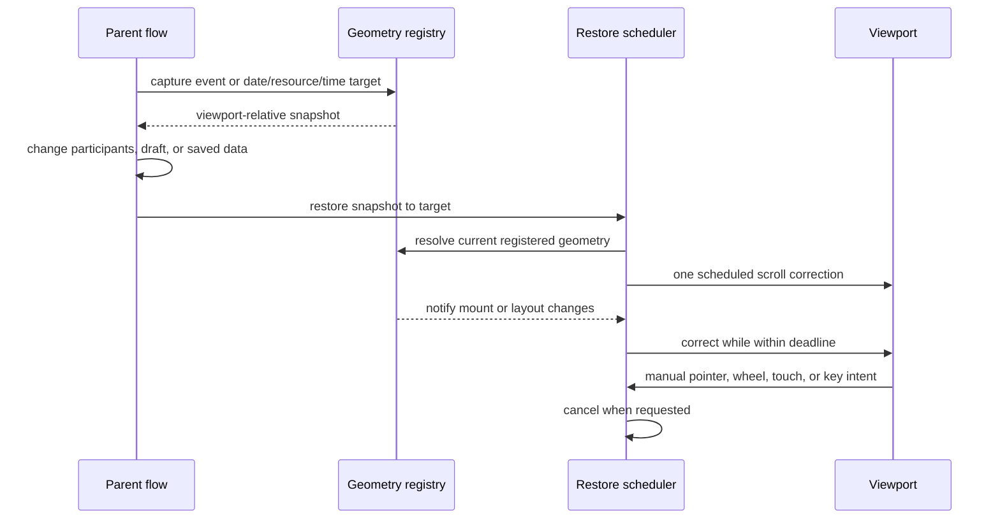

One mutation observer, one resize observer, registry notifications, and one animation-frame slot replace selector polling and timeout ladders. Restores that opt into `cancelOnManualScroll` cancel synchronously on pointer, wheel, touch, or scroll-key intent so a queued correction cannot consume the user's first movement. Navigation fallback remains available when a target is not mounted.

Anchor names describe different owners rather than interchangeable snapshots: parent viewport restore, active gesture, pending navigation, automatic data-layout correction, and idle virtual-window recenter. Higher-priority owners suppress lower-priority scroll writes. See the [anchor taxonomy and priority diagram](./flows/README.md#anchor-taxonomy).

## Styling And Packaging

Native CSS sticky positioning owns date, resource, and time labels. Reusable CSS is split into base, horizontal, vertical, and event-shell ownership files.

Package builds emit JavaScript and an explicit `quno-calendar/styles.css`; JavaScript does not inject CSS or access `document` during import. Both ESM import and CommonJS `require` are safe in Node/SSR environments. Library date parsing and labels use small local/`Intl` helpers, so `date-fns` is not a runtime dependency of consumers.
