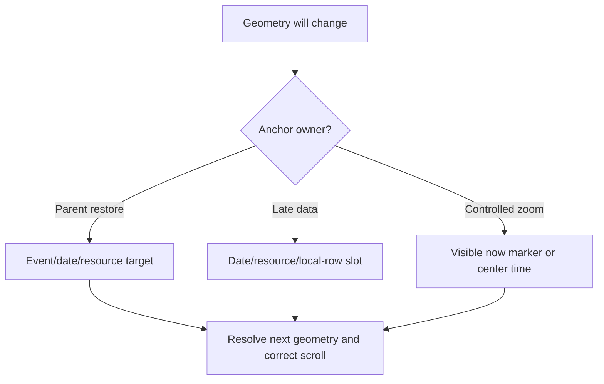

# Anchors Domain

## Responsibility

Own **visual focus**: the semantic date, resource, event, or time location that stays at the same viewport-relative coordinate while geometry changes. Visual focus is independent of browser DOM focus.

Priority and interaction with scroll maintenance are defined in the [Flow Guide](../flows/README.md#anchor-priority).

## Contracts And Invariants

- Parent restore outranks gesture, navigation, automatic data-layout correction, and idle recentering.
- Newly loaded events never become focus targets merely because they appeared.
- Event focus is a visibility guarantee: fully visible shells do not cause scroll writes, while clipped or offscreen
  shells are brought into the uncovered content viewport.
- Horizontal late-data restoration preserves date/resource/local-row offset; missing resources fall back to date-local offset.
- Controlled zoom remains parent-owned through `settings.zoom` and only requests changes with `onZoomChange`.
- Manual user intent cancels eligible scheduled restoration.

## Source Map

| Source file                                                                                                        | Responsibility                                                                                               |
| ------------------------------------------------------------------------------------------------------------------ | ------------------------------------------------------------------------------------------------------------ |
| [`viewportAnchorTypes.ts`](../../src/lib/infinite/anchors/parent/viewportAnchorTypes.ts)                           | Defines internal geometry registration and restore-target contracts.                                         |
| [`viewportGeometryRegistry.ts`](../../src/lib/infinite/anchors/parent/viewportGeometryRegistry.ts)                 | Indexes mounted date, resource, and event elements for semantic resolution.                                  |
| [`viewportAnchorRestoreSession.ts`](../../src/lib/infinite/anchors/parent/viewportAnchorRestoreSession.ts)         | Schedules, retries, cancels, and completes one parent-owned restoration.                                     |
| [`useViewportAnchoring.ts`](../../src/lib/infinite/anchors/parent/useViewportAnchoring.ts)                         | Exposes capture/restore operations and geometry registration to a view.                                      |
| [`horizontalDataLayoutAnchor.ts`](../../src/lib/infinite/anchors/data-layout/horizontalDataLayoutAnchor.ts)        | Captures and resolves date/resource offsets across horizontal metric changes.                                |
| [`useHorizontalDayMeasurement.ts`](../../src/lib/infinite/anchors/data-layout/useHorizontalDayMeasurement.ts)      | Measures changed days and restores the current semantic slot before paint.                                   |
| [`useHorizontalControlledZoomAnchor.ts`](../../src/lib/infinite/anchors/zoom/useHorizontalControlledZoomAnchor.ts) | Preserves a visible now marker, with center/origin fallback, across controlled horizontal zoom prop changes. |

## Verification Map

- Unit: geometry registry full-visibility checks, data-layout anchor, controlled zoom anchor, and resize compensation.
- Browser: async height growth, external layout restore/cancel, conditional event-focus scrolling, date/time navigation,
  zoom continuity, and interaction priority.
