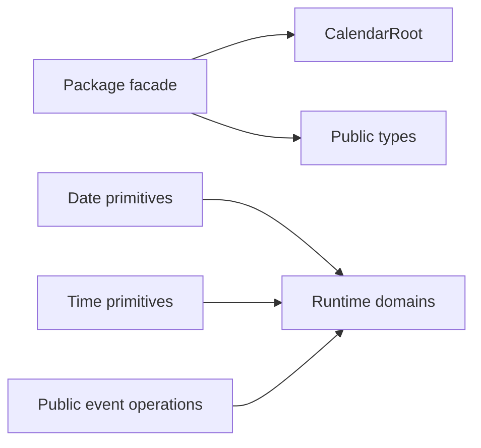

# Foundation Domain

## Responsibility

Own the public package facade and pure cross-domain primitives: public types, calendar root selection, date normalization, time conversion, tick generation, and public event membership operations.

## Source Map

| Source file                                                         | Responsibility                                                                         |
| ------------------------------------------------------------------- | -------------------------------------------------------------------------------------- |
| [`index.ts`](../../src/lib/index.ts)                                | Defines the supported package exports and public compatibility boundary.               |
| [`CalendarRoot.tsx`](../../src/lib/core/CalendarRoot.tsx)           | Selects horizontal or vertical projection from public props.                           |
| [`types.ts`](../../src/lib/core/types.ts)                           | Defines the public API, events, settings, renderers, navigation, and anchor contracts. |
| [`calendarEvents.ts`](../../src/lib/data/calendarEvents.ts)         | Implements exported event membership and immutable move helpers.                       |
| [`eventPrefetch.ts`](../../src/lib/data/eventPrefetch.ts)           | Defines the exported default event-prefetch policy.                                    |
| [`dateLabels.ts`](../../src/lib/date/dateLabels.ts)                 | Formats localized calendar date labels.                                                |
| [`dateVirtualization.ts`](../../src/lib/date/dateVirtualization.ts) | Normalizes excluded dates and maps virtual offsets to date keys.                       |
| [`localDate.ts`](../../src/lib/date/localDate.ts)                   | Parses and formats local dates without UTC drift.                                      |
| [`time.ts`](../../src/lib/time/time.ts)                             | Converts minutes, pixels, clock strings, and ISO timestamps.                           |
| [`timelineTicks.ts`](../../src/lib/time/timelineTicks.ts)           | Defines shared time-grid cadence, adaptive labels, and timeline gutter geometry.       |

## Verification Map

- Unit: public event helpers, local date behavior, virtualization math, and time conversions.
- Package: TypeScript declarations, ESM, CommonJS, SSR, stylesheet export, and isolated consumer build.
