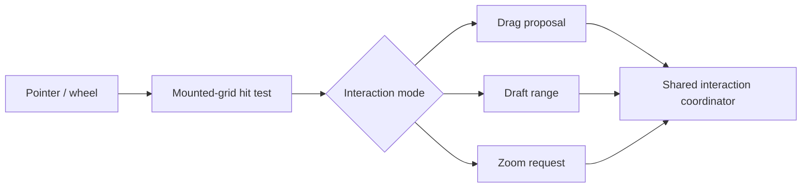

# Interactions Domain

## Responsibility

Own user-input interpretation from pointer or wheel signals through hit testing, draft/drag state, validation requests, and controlled zoom requests. It does not render product cards or mutate parent-controlled settings.

See [Interactions And Zoom](../flows/interactions-and-zoom.md) for gesture sequences and cancellation paths.

## Contracts And Invariants

- Hit testing is restricted to mounted timeline grid cells, never left-side labels.
- Pointer continuation may leave the viewport without losing the active gesture.
- Multi-calendar hover is row-local; drag and draft status remains event-id based.
- Accepted drag/create operations patch the event cache through callbacks owned by the view composition.
- Shift-wheel captures one pointer-nearest time node for the wheel burst and requests controlled zoom.

## Source Map

| Source file                                                                                                                | Responsibility                                                                          |
| -------------------------------------------------------------------------------------------------------------------------- | --------------------------------------------------------------------------------------- |
| [`timelineInteractionModel.ts`](../../src/lib/infinite/interactions/timelineInteractionModel.ts)                           | Defines shared hit results and pure draft/move proposal construction.                   |
| [`useTimelineInteractions.ts`](../../src/lib/infinite/interactions/useTimelineInteractions.ts)                             | Composes drag, draft, pointer continuation, selection locking, and public render state. |
| [`useGlobalPointerContinuation.ts`](../../src/lib/infinite/interactions/pointer/useGlobalPointerContinuation.ts)           | Continues active pointer gestures through window-level pointer events.                  |
| [`useInteractionSelectionLock.ts`](../../src/lib/infinite/interactions/pointer/useInteractionSelectionLock.ts)             | Temporarily disables text selection while drawing or dragging.                          |
| [`hitTestingTypes.ts`](../../src/lib/infinite/interactions/hit-testing/hitTestingTypes.ts)                                 | Defines mounted-grid identity and coordinate projection contracts.                      |
| [`timelineHitTarget.ts`](../../src/lib/infinite/interactions/hit-testing/timelineHitTarget.ts)                             | Finds the owning mounted date/resource grid beneath a pointer.                          |
| [`useHorizontalTimelineHitTesting.ts`](../../src/lib/infinite/interactions/hit-testing/useHorizontalTimelineHitTesting.ts) | Projects horizontal pointer coordinates into date/resource/time hits.                   |
| [`useVerticalTimelineHitTesting.ts`](../../src/lib/infinite/interactions/hit-testing/useVerticalTimelineHitTesting.ts)     | Projects vertical pointer coordinates into date/resource/time hits.                     |
| [`useTimelineHitTesting.ts`](../../src/lib/infinite/interactions/hit-testing/useTimelineHitTesting.ts)                     | Provides the orientation hit-testing compatibility exports.                             |
| [`dragInteractionModel.ts`](../../src/lib/infinite/interactions/drag/dragInteractionModel.ts)                              | Builds calendar-membership-aware drag previews and move proposals.                      |
| [`sameMoveRequest.ts`](../../src/lib/infinite/interactions/drag/sameMoveRequest.ts)                                        | Detects semantic changes before publishing a new move proposal.                         |
| [`useTimelineDragInteraction.ts`](../../src/lib/infinite/interactions/drag/useTimelineDragInteraction.ts)                  | Owns drag candidate, threshold, preview, validation, and accepted commit lifecycle.     |
| [`useReleasedDraft.ts`](../../src/lib/infinite/interactions/draft/useReleasedDraft.ts)                                     | Keeps a released draft rendered through its optional exit duration.                     |
| [`useTimelineDraftInteraction.ts`](../../src/lib/infinite/interactions/draft/useTimelineDraftInteraction.ts)               | Owns drawn ranges, draft delegation, immediate create, and cache insertion.             |
| [`zoomLimits.ts`](../../src/lib/infinite/interactions/zoom/zoomLimits.ts)                                                  | Defines the supported controlled zoom interval.                                         |
| [`shiftWheelZoomUtils.ts`](../../src/lib/infinite/interactions/zoom/shiftWheelZoomUtils.ts)                                | Shares wheel-burst capture, gesture-tail timing, and version guards.                    |
| [`useHorizontalShiftWheelZoom.ts`](../../src/lib/infinite/interactions/zoom/useHorizontalShiftWheelZoom.ts)                | Anchors horizontal shift-wheel zoom to the pointer-nearest time node.                   |
| [`useVerticalShiftWheelZoom.ts`](../../src/lib/infinite/interactions/zoom/useVerticalShiftWheelZoom.ts)                    | Anchors vertical shift-wheel zoom to the pointer date/time location.                    |
| [`useShiftWheelZoom.ts`](../../src/lib/infinite/interactions/zoom/useShiftWheelZoom.ts)                                    | Provides orientation zoom compatibility exports.                                        |

## Verification Map

- Unit: hit target, interaction model, move membership, and zoom preparation tests.
- Browser: drag, draft creation, external cancel, hover locality, shift-wheel zoom, and label hit-test exclusion.
