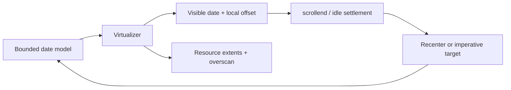

# Scroll Domain

## Responsibility

Own the finite browser-scroll representation of an unbounded date timeline: date-window construction, visible position, settlement, recentering, imperative date navigation, and cross-axis resource windowing. It publishes visible date keys for event prefetch but never invokes the event loader.

See [Virtual Scroll And Recenter](../flows/virtual-scroll-and-recenter.md) for execution sequences.

## Contracts And Invariants

- Preserve `{dateKey, offsetWithinDate}` across bounded-window rebuilds.
- Exact item boundaries belong to the following date via the one-pixel probe.
- Active pointer interactions defer idle recentering.
- Resource windowing never compacts the full board; unmounted resources keep their original offsets.
- Structural size restoration is separate from late-event data-layout anchoring.

## Source Map

| Source file                                                                                                         | Responsibility                                                                                                           |
| ------------------------------------------------------------------------------------------------------------------- | ------------------------------------------------------------------------------------------------------------------------ |
| [`useScrollRuntime.ts`](../../src/lib/infinite/scroll/useScrollRuntime.ts)                                          | Composes the shared date model, virtualizer, visible-position tracker, navigation, render items, and layout restoration. |
| [`scrollConstants.ts`](../../src/lib/infinite/scroll/scrollConstants.ts)                                            | Defines scroll settlement delay and date-node overscan policy.                                                           |
| [`dateModel.ts`](../../src/lib/infinite/scroll/window/dateModel.ts)                                                 | Maps normalized date keys to bounded virtual indexes.                                                                    |
| [`renderItems.ts`](../../src/lib/infinite/scroll/window/renderItems.ts)                                             | Builds measured, fallback, and pinned date render items.                                                                 |
| [`useVirtualDateRenderItems.ts`](../../src/lib/infinite/scroll/window/useVirtualDateRenderItems.ts)                 | Memoizes render items from virtualizer output and optional pins.                                                         |
| [`useVerticalProjectionRenderWindow.ts`](../../src/lib/infinite/scroll/window/useVerticalProjectionRenderWindow.ts) | Keeps the semantic top-date window on new base-day geometry while vertical zoom measurements settle.                     |
| [`scrollPositionTypes.ts`](../../src/lib/infinite/scroll/position/scrollPositionTypes.ts)                           | Defines the pending date-local target retained across model rebuilds.                                                    |
| [`visibleSnapshot.ts`](../../src/lib/infinite/scroll/position/visibleSnapshot.ts)                                   | Resolves visible date snapshots and generic fully-above resize compensation.                                             |
| [`useVisibleDateState.ts`](../../src/lib/infinite/scroll/position/useVisibleDateState.ts)                           | Owns refs for the newest valid date, local offset, and pending target.                                                   |
| [`useVirtualScrollPosition.ts`](../../src/lib/infinite/scroll/position/useVirtualScrollPosition.ts)                 | Translates date-local positions to absolute offsets and observes the current viewport.                                   |
| [`useScrollRecenter.ts`](../../src/lib/infinite/scroll/settlement/useScrollRecenter.ts)                             | Coalesces scroll and `scrollend` into one guarded settlement request.                                                    |
| [`useLayoutOffsetRestoration.ts`](../../src/lib/infinite/scroll/recenter/useLayoutOffsetRestoration.ts)             | Restores or translates the top date after structural settings changes.                                                   |
| [`useVirtualWindowNavigation.ts`](../../src/lib/infinite/scroll/navigation/useVirtualWindowNavigation.ts)           | Promotes settled or imperative targets into the bounded date window.                                                     |
| [`resourceWindow.ts`](../../src/lib/infinite/scroll/resources/resourceWindow.ts)                                    | Builds prefix extents and finds visible resource indexes with overscan and pins.                                         |
| [`viewportMetricsStore.ts`](../../src/lib/infinite/scroll/resources/viewportMetricsStore.ts)                        | Publishes frame-batched viewport metrics to resource-window subscribers.                                                 |

## Verification Map

- Unit: `virtualTimelineWindow`, `resourceWindow`, and late-height resize predicate tests.
- Browser: navigation, sticky positioning, recentering, resource windowing, async layout anchoring, and both orientations.
