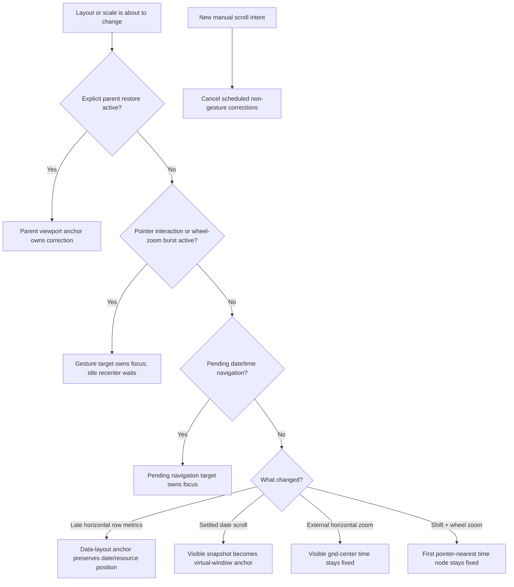

# Calendar Runtime Flow Guide

These guides expand the overview in [`docs/architecture.md`](../architecture.md) into concrete runtime stories. Each guide follows a trigger through state ownership, async boundaries, layout work, viewport correction, cancellation, and rendering. The diagrams describe library behavior; examples and product UI remain consumers of that behavior.

For the complementary ownership view and a source-file-by-source-file map, see [`docs/domains`](../domains/README.md).

## Guide Map

| Guide                                                           | Use it to answer                                                                                                                                   |
| --------------------------------------------------------------- | -------------------------------------------------------------------------------------------------------------------------------------------------- |
| [Async Loading And Layout](./async-loading-and-layout.md)       | What renders before events arrive? How are stale responses rejected? What stays visually focused when late events increase horizontal row heights? |
| [Virtual Scroll And Recenter](./virtual-scroll-and-recenter.md) | How can a finite scrollbar represent unbounded dates? What is captured at scroll end, and how is the bounded window rebuilt without a jump?        |
| [Interactions And Zoom](./interactions-and-zoom.md)             | How are pointer events routed? When is local cache state patched? Which time node remains stationary during each zoom path?                        |

## What “Focus” Means Here

These documents use **visual focus** to mean the semantic calendar location that stays at the same viewport-relative coordinate while layout changes. It is separate from browser DOM focus. Async event arrival mounts event shells but never calls `focus()` and never transfers keyboard focus from a control.

## Anchor Taxonomy

“Anchor” is intentionally qualified because several related mechanisms solve different problems.

| Anchor                    | Shape                                                                                                 | Owner                     | Lifetime                           | Purpose                                                                           |
| ------------------------- | ----------------------------------------------------------------------------------------------------- | ------------------------- | ---------------------------------- | --------------------------------------------------------------------------------- |
| Virtual-window anchor     | A normalized date key                                                                                 | Date virtualizer          | Until the next settled recenter    | Centers the bounded month-before/month-after date model.                          |
| Visible-position snapshot | `{ dateKey, offsetWithinDate }`                                                                       | Scroll runtime            | Updated while scrolling            | Remembers the top visible date and exact local pixel offset.                      |
| Data-layout anchor        | A date snapshot, or `{ dateKey, calendarId, offsetWithinRow, fallbackOffsetWithinDate }` horizontally | Layout measurement bridge | One late metric commit             | Preserves the viewed date or resource row when async data changes row/day height. |
| Parent viewport anchor    | Event or date/resource/time target plus viewport-relative geometry                                    | Public imperative API     | Explicit capture/restore session   | Preserves product-owned create, edit, save, cancel, or participant-change focus.  |
| Zoom anchor               | Time at grid center or the rendered time node nearest the pointer                                     | Zoom controller           | One prop change or one wheel burst | Preserves temporal focus while scale changes.                                     |

The same date may participate in several anchors, but only one mechanism should write scroll position for a particular change.

## Anchor Priority

When mechanisms overlap, use this order:

1. Active parent viewport restore.
2. Active draw, drag, or wheel-zoom gesture.
3. Pending imperative date/time navigation.
4. Automatic data-layout correction.
5. Idle virtual-window recenter.

Manual pointer, wheel, touch, or scroll-key intent cancels an opted-in restore immediately. Async event content never becomes an anchor merely because it arrived.

## Module Comment Convention

Non-trivial production modules document the same five questions at the top of the file:

- **Responsibility:** the state or transformation the module owns.
- **Flow:** its inputs, decisions, writes, and outputs.
- **Preserves:** invariants that downstream code may rely on.
- **Does not own:** neighboring responsibilities that must remain elsewhere.
- **Failure/cancellation:** how incomplete or obsolete work exits.

Detailed diagrams stay in this directory so source headers can remain short and link to one authoritative flow.
