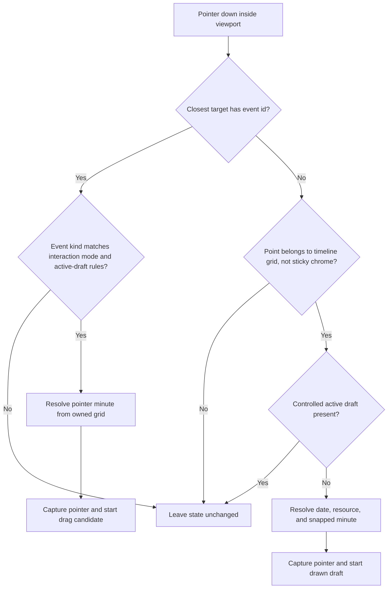
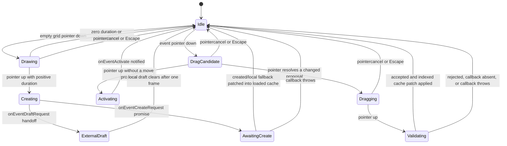
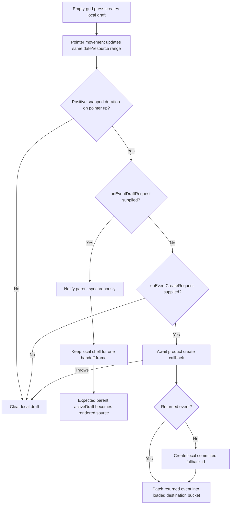
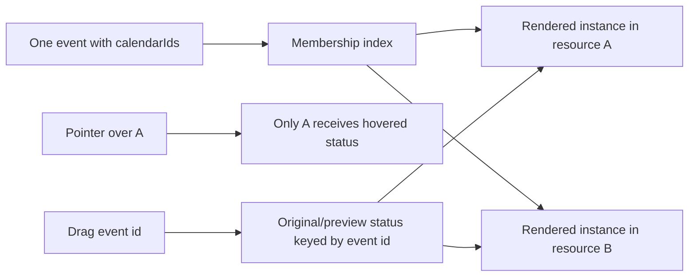
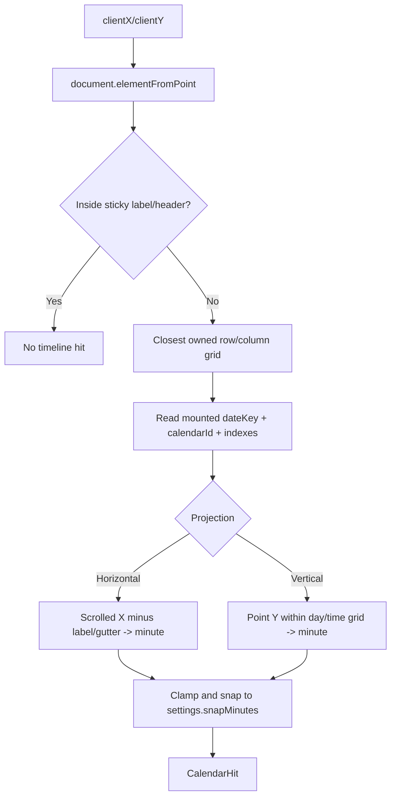
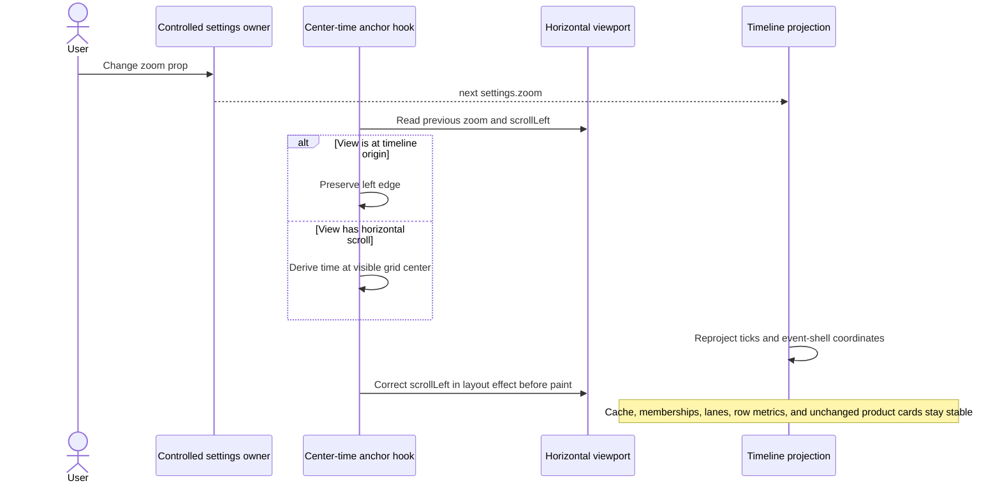
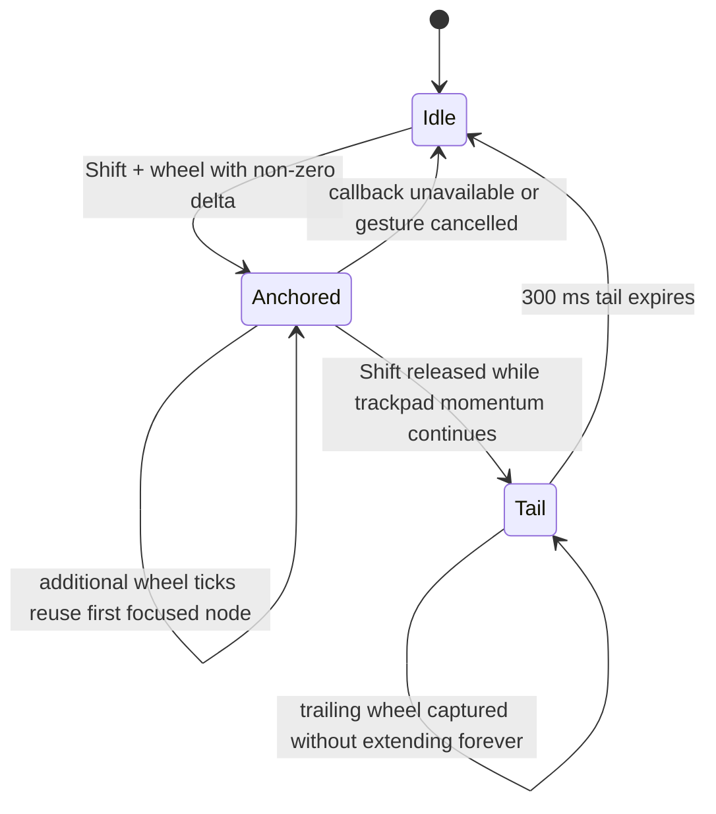

# Interactions And Zoom

Both orientations share one Pointer Events lifecycle. Projection-specific hit testing converts a mounted grid owner and pointer coordinate into the same `{ dateKey, calendarId, minute }` domain target. Product callbacks validate mutations; rendering layers show drafts and previews without changing committed layout.

## Pointer Routing



The DOM grid is the ownership source. The virtualizer supplies mounted dates, but hit-testing does not recompute a resource from a possibly stale global height estimate.

## Shared Interaction State



`DragCandidate` is represented by drag state with no preview rather than by a separate exported enum. A click is recognized when pointer-up finds no changed proposal.

## Drag And Drop Validation

```mermaid
sequenceDiagram
  actor User
  participant Hit as Projection hit tester
  participant Drag as Drag controller
  participant Layer as Preview layer
  participant Parent as Product callback
  participant Cache as Loaded event cache

  User->>Drag: Pointer down on event instance
  Drag->>Hit: Resolve pointer minute and resource owner
  Hit-->>Drag: Start hit + pointer offset
  User->>Drag: Pointer move
  Drag->>Hit: Resolve current hit
  Hit-->>Drag: Date/resource/snapped minute
  Drag->>Drag: Build clamped move proposal
  Drag-->>Layer: Render drop preview; hide original shell
  User->>Drag: Pointer up
  Drag->>Parent: onEventMoveRequest(proposal)
  alt Parent resolves false or throws
    Parent-->>Drag: Reject
    Drag->>Layer: Remove preview; reveal cached original
  else Parent accepts
    Parent-->>Drag: Accept
    Drag->>Cache: Patch event through id index
    Cache-->>Layer: Render committed destination
  end
```

For a controlled active draft, proposals go to `onActiveDraftMoveRequest` and parent draft state remains authoritative. A normal cache move is not applied to that draft.

## Drawn Creation Subflows



The drawn shell is an overlay. It does not enter overlap lanes or grow row/column metrics while the pointer moves.

## Multi-Calendar Semantics



Hover answers “which instance is under the pointer?” Drag answers “which logical event is moving?” Keeping those identities separate avoids expanding every copy on hover while still showing one coherent move.

## Hit-Testing Pipelines



## Controlled Zoom Contract

The calendar never owns the canonical zoom value. A gesture calculates a requested value and calls `onZoomChange`; the parent writes it back through `settings.zoom`. Rendering may apply a local horizontal viewport-fill floor, but that floor does not emit a new parent value.

### Slider Or External Horizontal Zoom



### Shift + Wheel Gesture Burst



```mermaid
sequenceDiagram
  actor User
  participant Wheel as Orientation zoom hook
  participant Parent as Controlled zoom owner
  participant Render as Calendar render
  participant View as Scroll viewport

  User->>Wheel: First Shift + wheel tick
  Wheel->>View: Find rendered time-grid node nearest pointer
  Wheel->>Wheel: Save node minute/date and screen coordinate
  Wheel->>Parent: onZoomChange(nextZoom)
  Parent-->>Render: Commit settings.zoom
  Render->>Render: Reproject time geometry
  Wheel->>View: Restore saved node across scheduled frames
  User->>Wheel: More ticks in same burst
  Wheel->>Wheel: Reuse first anchor; version old restores out
  Note over Wheel,View: Generic horizontal center correction is suppressed during this gesture
```

Horizontal wheel zoom preserves a time node on X. Vertical wheel zoom preserves a date/time node on Y, clamps it to configured timeline bounds, records the translated visible date offset, and prevents the subsequent idle recenter from restoring stale pixels.

## Interaction And Zoom Invalidation Matrix

| Trigger                         | Local updates                                                  | Remains stable                                               |
| ------------------------------- | -------------------------------------------------------------- | ------------------------------------------------------------ |
| Row/column hover                | One rendered resource instance and shell status                | Cache, lanes, sibling multi-calendar instances               |
| Draft pointer move              | Draft hit and overlay geometry                                 | Committed prepared cell and row/column metric                |
| Drag pointer move               | Proposal and preview overlay                                   | Committed cache until parent accepts                         |
| Accepted drop                   | Indexed old/new buckets and affected prepared cells            | Unrelated date/resource cells                                |
| Rejected drop or callback throw | Preview cleared                                                | Original cached event and geometry                           |
| Slider zoom                     | Projected coordinates, ticks, and scroll anchor                | Loader, cache, memberships, lanes, external renderer content |
| Shift-wheel tick                | Controlled zoom request, gesture anchor, projected coordinates | First anchor target for the burst and prepared data          |
| Normal wheel after gesture tail | Ordinary viewport scroll                                       | Zoom value                                                   |

## Failure And Cancellation Rules

| Condition                                              | Behavior                                                                                                         |
| ------------------------------------------------------ | ---------------------------------------------------------------------------------------------------------------- |
| Pointer leaves calendar while captured                 | Window continuation handles move/up/cancel without duplicating events that already bubbled through the viewport. |
| `pointercancel` or Escape                              | Clear drag and draft state, preview, hover, and selection lock.                                                  |
| Move callback returns `false`                          | Treat as rejected; do not patch cache.                                                                           |
| Move/create callback throws                            | Clear transient state; keep committed cache unchanged.                                                           |
| Hit moves outside the starting draft date/resource     | Keep the active draft lifecycle but ignore invalid range expansion.                                              |
| Zoom callback is absent                                | Do not consume Shift-wheel as a controlled zoom mutation.                                                        |
| Older scheduled zoom restore runs after a newer tick   | Restore-version check discards it.                                                                               |
| Immediate wheel momentum follows Shift release         | Capture it during the bounded gesture tail, then return control to normal scrolling.                             |
| Manual scroll begins during an opted-in parent restore | Cancel the restore synchronously so correction cannot consume the first movement.                                |

## Source Map

- `src/lib/infinite/interactions/useTimelineInteractions.ts`: shared pointer routing and public render state.
- `src/lib/infinite/interactions/drag/useTimelineDragInteraction.ts`: drag candidate, proposal, validation, and cache patch.
- `src/lib/infinite/interactions/draft/useTimelineDraftInteraction.ts`: drawn range and internal/external create paths.
- `src/lib/infinite/interactions/hit-testing/timelineHitTarget.ts`: mounted grid ownership.
- `src/lib/infinite/interactions/hit-testing/useHorizontalTimelineHitTesting.ts`: horizontal coordinate projection.
- `src/lib/infinite/interactions/hit-testing/useVerticalTimelineHitTesting.ts`: vertical coordinate projection.
- `src/lib/infinite/interactions/zoom/shiftWheelZoomUtils.ts`: shared gesture tail, versioning, and captured wheel utilities.
- `src/lib/infinite/interactions/zoom/useHorizontalShiftWheelZoom.ts`: pointer-nearest horizontal time anchor.
- `src/lib/infinite/interactions/zoom/useVerticalShiftWheelZoom.ts`: date/time vertical anchor.
- `src/lib/infinite/anchors/zoom/useHorizontalControlledZoomAnchor.ts`: slider/external center-time correction.

The complete ownership map is in [`docs/domains/interactions.md`](../domains/interactions.md) and [`docs/domains/anchors.md`](../domains/anchors.md).
