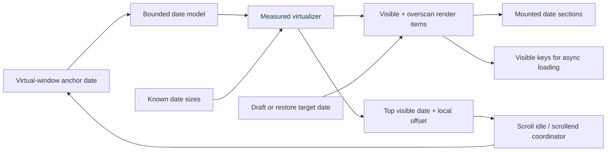
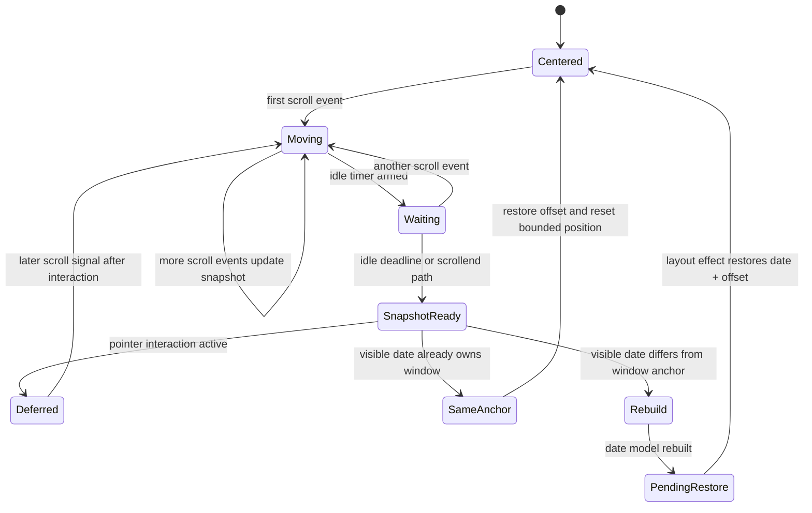
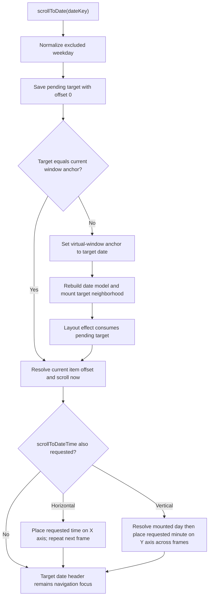
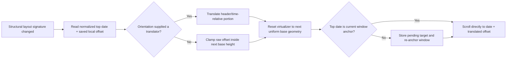
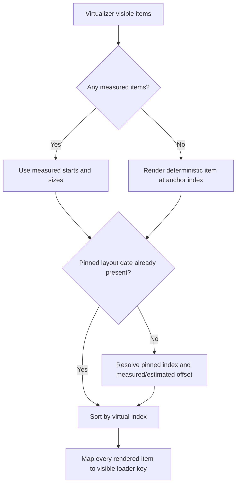
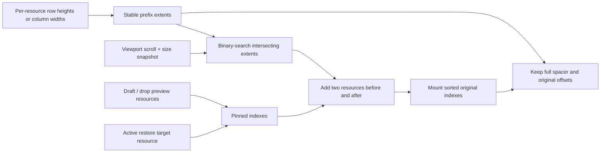
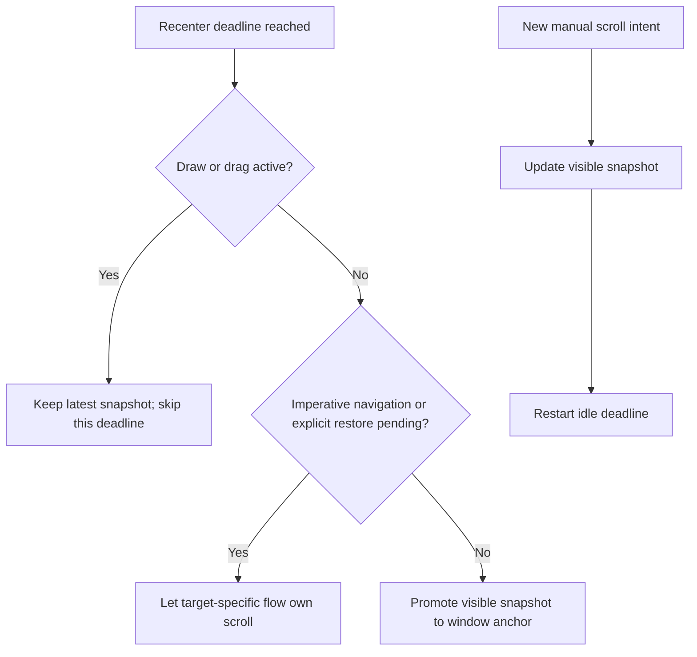

# Virtual Scroll And Recenter

The calendar presents continuous date navigation through a bounded scrollbar. The virtual date model contains roughly one month before and after its current anchor, while the DOM contains only visible dates, overscan, and at most one pinned layout date.

## Ownership Map



The virtual-window anchor chooses the bounded date range. It is not itself the visible DOM element, browser focus, or an event anchor.

## Settled Scroll Lifecycle

```mermaid
sequenceDiagram
  actor User
  participant View as Scroll viewport
  participant Position as Visible-position tracker
  participant Idle as Recenter scheduler
  participant Nav as Window navigation
  participant Model as Bounded date model
  participant Virtualizer as Virtualizer

  User->>View: Wheel, touch, keys, or scrollbar drag
  View->>Position: scrollTop changed
  Position->>Virtualizer: Resolve item containing one-pixel probe
  Virtualizer-->>Position: Date index, start, and size
  Position->>Position: Store dateKey + offsetWithinDate
  Position->>Idle: Restart idle deadline
  alt Browser emits scrollend
    View->>Idle: Schedule the same settled path
  end
  alt Draw or drag remains active
    Idle->>Idle: Skip this deadline; a later scroll signal can reschedule
  else Scroll settles
    Idle->>Nav: Recenter visible snapshot
    Nav->>Nav: Normalize date and store pending target
    Nav->>Model: Set new virtual-window anchor
    Model-->>Virtualizer: Rebuild bounded date/index mapping
    Virtualizer-->>Nav: New offsets available
    Nav->>View: Restore exact date-local offset in layout effect
  end
```

The one-pixel probe makes an exact item boundary belong to the following date rather than the date that ends at that coordinate.
The scheduler uses the ordinary 1.2-second deadline inside the bounded range. When `scrollTop` reaches the absolute top
or bottom within one device-independent pixel, it uses a 240 ms deadline instead. More scroll always replaces the
pending timer and recalculates which deadline applies.

## Recenter State Machine



Same-anchor recentering is intentional. It resets the scrollbar thumb toward the center of the bounded range even when the top date key has not changed.

## Imperative Navigation



The repeated frame is a mount/measurement bridge, not polling. The bounded model may need one React commit before the target day exists.

## Position Snapshots And Layout Changes

Two translations use date-local offsets:

1. **Window recenter:** preserve the exact raw offset inside the top date while date indexes are rebuilt.
2. **Structural layout change:** align the preserved date header for calendar membership changes; translate or clamp
   the saved offset for settings-driven geometry changes such as zoom.



This structural path is distinct from late horizontal event metrics. Async row-height commits use the data-layout anchor described in [Async Loading And Layout](./async-loading-and-layout.md#late-events-that-increase-horizontal-height).

Changing `excludedWeekdays` replaces the virtualizer's date-to-index sequence, so its pre-change pixel offset cannot be
interpreted in the new model. The structural restore first uses base geometry, then repeats the semantic-date alignment
after the virtualizer has adopted the new keys and horizontal variable measurements. During controlled-draft row
collapse or expansion, a current or just-released draft date that belongs to the ordinary virtual viewport overrides
transient top-date snapshots; an offscreen pinned draft yields to the visible date. The explicit parent event/slot
restore remains responsible for the exact viewport-relative row position.

Vertical dates have one uniform settings-owned height, so a structural zoom restore resets every bounded date measurement to the new base height before writing the translated scroll offset. While those measurements settle, rendering stays pinned to a base-geometry window around the semantic top date. This prevents pre-commit virtualizer measurements from converting the saved date-local position through stale zoom geometry or exposing a transient blank/wrong-date window.

## Date Render Items



The pinned layout date is mounted once without widening ordinary overscan. Pinning makes geometry resolvable; it does not replace the current scroll anchor.

## Cross-Axis Resource Window

Each mounted date independently windows its resource axis.



Unmounted resources never compact the board. Hit-testing reads the mounted grid’s `data-date` and `data-calendar-id`, so an async size change cannot make a pointer resolve through stale row arithmetic.

## Recenter And Anchor Priority

Idle recenter is lowest priority because it changes the virtual model for maintenance rather than responding to a direct user goal.



## Failure And Cancellation Subflows

| Condition                                         | Resolution                                                                                 |
| ------------------------------------------------- | ------------------------------------------------------------------------------------------ |
| Immediate snapshot unavailable after a large jump | Keep the last valid or imperative pending target; the deadline re-reads after items mount. |
| Target date is excluded                           | Normalize to the nearest permitted date before storing refs or indexes.                    |
| Saved offset is negative                          | Clamp it to zero.                                                                          |
| Structural change makes a date shorter            | Clamp or orientation-translate the offset so the same date remains visible.                |
| Viewport reaches the absolute top or bottom       | Reduce the recenter deadline from 1.2 seconds to 240 ms.                                   |
| More scroll arrives before idle deadline          | Clear the old timer, update the snapshot, and schedule once.                               |
| Component unmounts                                | Clear the fallback timer; no deferred scroll survives.                                     |
| Interaction remains active at deadline            | Do not rebuild the window; the next settled path uses the newest snapshot.                 |
| Date already equals the window anchor             | Still restore the saved offset so the scrollbar returns to its centered bounded position.  |

## Source Map

- `src/lib/infinite/scroll/useScrollRuntime.ts`: composes the bounded model, virtualizer, position tracker, render items, navigation, and layout restoration.
- `src/lib/infinite/scroll/window/dateModel.ts`: normalized date/index mapping.
- `src/lib/infinite/scroll/position/useVirtualScrollPosition.ts`: scroll offset and visible snapshot bridge.
- `src/lib/infinite/scroll/navigation/useVirtualWindowNavigation.ts`: pending targets, imperative navigation, and recenter ownership.
- `src/lib/infinite/scroll/settlement/useScrollRecenter.ts`: scroll/scrollend scheduling and interaction guard.
- `src/lib/infinite/scroll/recenter/useLayoutOffsetRestoration.ts`: structural layout translation.
- `src/lib/infinite/scroll/window/useVirtualDateRenderItems.ts`: visible, fallback, and pinned render items.
- `src/lib/infinite/scroll/resources/resourceWindow.ts`: resource prefix extents and cross-axis window search.
- `src/lib/infinite/scroll/resources/viewportMetricsStore.ts`: frame-batched viewport snapshots for local subscribers.

The complete ownership map is in [`docs/domains/scroll.md`](../domains/scroll.md).
