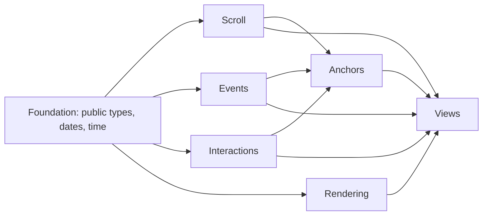

# Runtime Responsibility Domains

The source tree is organized by **ownership**, while the [runtime flows](../flows/README.md) are organized by
**execution order**. A domain answers “who owns this state or decision?”; a flow answers “what happens next?”.

## Domain Index

| Domain                            | Owns                                                                          | Does not own                          |
| --------------------------------- | ----------------------------------------------------------------------------- | ------------------------------------- |
| [Foundation](./foundation.md)     | Public facade, shared types, dates, time, public event membership helpers     | Runtime coordination                  |
| [Scroll](./scroll.md)             | Bounded date window, visible position, settlement, recenter, resource windows | Event requests or visual-focus policy |
| [Events](./events.md)             | Loading, cache, indexing, overlap layout, measured event geometry             | Scrolling or rendering                |
| [Anchors](./anchors.md)           | Semantic visual position across layout, zoom, and parent restore              | DOM focus or gesture recognition      |
| [Interactions](./interactions.md) | Pointer lifecycle, hit testing, drag, draft, wheel-zoom requests              | Rendering or controlled zoom state    |
| [Rendering](./rendering.md)       | DOM/CSS projection and render-only geometry                                   | Async loading or scroll writes        |
| [Views](./views.md)               | Horizontal/vertical composition and public projection boundaries              | Feature-domain internals              |

## Dependency Rules

- Feature engines may import foundation modules, never views.
- Scroll publishes visible positions and ranges; events decides what to prefetch.
- Anchors translate semantic positions using scroll and event geometry; scroll does not import anchors.
- Rendering receives prepared state and callbacks; it does not start requests or mutate controlled settings.
- Views are the composition root and may import every runtime domain.
- There are no generic `hooks`, `utils`, `common`, or `helpers` runtime directories.

The folder containing a source file identifies its domain. The source maps in these guides are maintained as navigation aids rather than duplicated as banners in every module.
