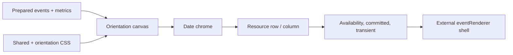

# Rendering Domain

## Responsibility

Own the render-only projection of prepared calendar state into DOM, CSS, event shells, sticky chrome, resource layers, and orientation geometry. Rendering receives callbacks and prepared models; it does not fetch events, own controlled settings, or write scroll position.

## Contracts And Invariants

- Product-specific event content remains external through `eventRenderer`.
- Event shell geometry is isolated from arbitrary renderer content.
- Native sticky positioning owns headers and labels.
- Cross-axis windowing preserves original spacer size and resource offsets.
- Dense time labels hide minor labels before overlap.

## Source Map

### Shared

| Source file                                                                                          | Responsibility                                                                        |
| ---------------------------------------------------------------------------------------------------- | ------------------------------------------------------------------------------------- |
| [`EventShell.tsx`](../../../src/lib/timeline/infinite/rendering/shared/EventShell.tsx)               | Hosts the external renderer inside geometry- and status-controlled shell layers.      |
| [`EventLayers.tsx`](../../../src/lib/timeline/infinite/rendering/shared/EventLayers.tsx)             | Shares committed, availability, draft, and preview state while views supply geometry. |
| [`CalendarHourBands.tsx`](../../../src/lib/timeline/infinite/rendering/shared/CalendarHourBands.tsx) | Projects product-owned hour presentation onto horizontal and vertical time geometry.  |
| [`TimeScaleHeader.tsx`](../../../src/lib/timeline/infinite/rendering/shared/TimeScaleHeader.tsx)     | Renders the sticky horizontal time scale, tick labels, and current-time pin.          |

### Horizontal

| Source file                                                                                                                      | Responsibility                                                              |
| -------------------------------------------------------------------------------------------------------------------------------- | --------------------------------------------------------------------------- |
| [`HorizontalTimelineCanvas.tsx`](../../../src/lib/timeline/infinite/rendering/horizontal/HorizontalTimelineCanvas.tsx)           | Renders the scroll container, sticky time scale, and virtual date items.    |
| [`HorizontalTimelineDay.tsx`](../../../src/lib/timeline/infinite/rendering/horizontal/HorizontalTimelineDay.tsx)                 | Renders one measured date header and its windowed resource rows.            |
| [`HorizontalTimelineRow.tsx`](../../../src/lib/timeline/infinite/rendering/horizontal/HorizontalTimelineRow.tsx)                 | Composes one resource grid and its event layers.                            |
| [`HorizontalDayHeader.tsx`](../../../src/lib/timeline/infinite/rendering/horizontal/HorizontalDayHeader.tsx)                     | Renders sticky date chrome and current-date state.                          |
| [`HorizontalRowFrame.tsx`](../../../src/lib/timeline/infinite/rendering/horizontal/HorizontalRowFrame.tsx)                       | Owns row grid geometry, sticky resource label, and geometry registration.   |
| [`horizontalEventGeometry.ts`](../../../src/lib/timeline/infinite/rendering/horizontal/horizontalEventGeometry.ts)               | Converts layout lanes and time intervals into horizontal CSS geometry.      |
| [`useHorizontalEventHover.ts`](../../../src/lib/timeline/infinite/rendering/horizontal/useHorizontalEventHover.ts)               | Resolves row-local horizontal hover expansion from prepared event geometry. |
| [`useHorizontalDayResourceWindow.ts`](../../../src/lib/timeline/infinite/rendering/horizontal/useHorizontalDayResourceWindow.ts) | Resolves visible/pinned row indexes for one rendered date.                  |
| [`useHorizontalViewportSizing.ts`](../../../src/lib/timeline/infinite/rendering/horizontal/useHorizontalViewportSizing.ts)       | Derives effective horizontal viewport width and timeline scale geometry.    |
| [`types.ts`](../../../src/lib/timeline/infinite/rendering/horizontal/types.ts)                                                   | Defines prepared render contracts shared by horizontal layers.              |

### Vertical

| Source file                                                                                                      | Responsibility                                                             |
| ---------------------------------------------------------------------------------------------------------------- | -------------------------------------------------------------------------- |
| [`VerticalTimelineCanvas.tsx`](../../../src/lib/timeline/infinite/rendering/vertical/VerticalTimelineCanvas.tsx) | Renders vertical virtual dates and forwards grid interaction callbacks.    |
| [`VerticalTimelineDay.tsx`](../../../src/lib/timeline/infinite/rendering/vertical/VerticalTimelineDay.tsx)       | Composes one vertical date’s chrome, board, and windowed columns.          |
| [`VerticalDayChrome.tsx`](../../../src/lib/timeline/infinite/rendering/vertical/VerticalDayChrome.tsx)           | Renders date headers, time labels, current-time chrome, and grid backdrop. |
| [`VerticalDayBoard.tsx`](../../../src/lib/timeline/infinite/rendering/vertical/VerticalDayBoard.tsx)             | Places visible calendar columns at their full-layout offsets.              |
| [`VerticalCalendarColumn.tsx`](../../../src/lib/timeline/infinite/rendering/vertical/VerticalCalendarColumn.tsx) | Composes one calendar column and registers its semantic geometry.          |
| [`useVerticalDayWindow.ts`](../../../src/lib/timeline/infinite/rendering/vertical/useVerticalDayWindow.ts)       | Resolves visible/pinned columns and vertical grid-line cadence.            |
| [`verticalGeometry.ts`](../../../src/lib/timeline/infinite/rendering/vertical/verticalGeometry.ts)               | Converts column layout results into event and hover geometry.              |
| [`verticalViewGeometry.ts`](../../../src/lib/timeline/infinite/rendering/vertical/verticalViewGeometry.ts)       | Derives vertical day size, layout signature, and date-offset translation.  |
| [`useVerticalColumnHover.ts`](../../../src/lib/timeline/infinite/rendering/vertical/useVerticalColumnHover.ts)   | Resolves hover expansion within one prepared vertical calendar column.     |
| [`types.ts`](../../../src/lib/timeline/infinite/rendering/vertical/types.ts)                                     | Defines vertical render contracts shared by boards and layers.             |

### Styles

| Source file                                                                              | Responsibility                                                    |
| ---------------------------------------------------------------------------------------- | ----------------------------------------------------------------- |
| [`calendar.css`](../../../src/lib/timeline/infinite/rendering/styles/calendar.css)       | Declares the explicit stylesheet entry and import order.          |
| [`base.css`](../../../src/lib/timeline/infinite/rendering/styles/base.css)               | Defines shared viewport, date, resource, and interaction styling. |
| [`horizontal.css`](../../../src/lib/timeline/infinite/rendering/styles/horizontal.css)   | Defines horizontal sticky and timeline geometry.                  |
| [`vertical.css`](../../../src/lib/timeline/infinite/rendering/styles/vertical.css)       | Defines vertical board, column, and time-axis geometry.           |
| [`event-shell.css`](../../../src/lib/timeline/infinite/rendering/styles/event-shell.css) | Defines event shell containment, states, and renderer isolation.  |

## Verification Map

- Unit: horizontal/vertical geometry, event-shell isolation, resource windows, and renderer stability.
- Browser: computed geometry, layering, clipping, sticky positioning, zoom continuity, and all demo routes.
