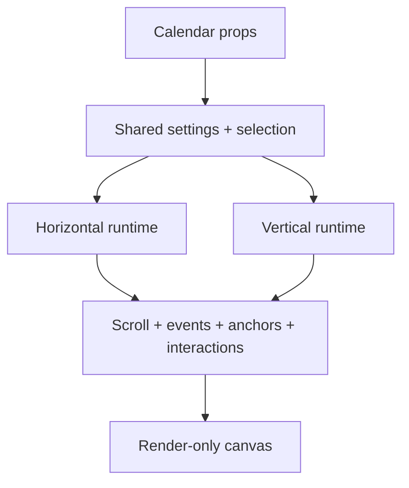

# Views Domain

## Responsibility

Own the horizontal and vertical composition roots. Views connect public props to scroll, events, anchors, interactions, and rendering without reimplementing those domains’ policies.

## Contracts And Invariants

- `QunoInfiniteCalendar` remains the public orientation switch.
- Views may compose every domain; feature domains never import views.
- Horizontal and vertical projections preserve identical public event and interaction semantics.
- Controlled settings are read from props and changes are requested through callbacks.

## Source Map

| Source file                                                                                                                    | Responsibility                                                                                  |
| ------------------------------------------------------------------------------------------------------------------------------ | ----------------------------------------------------------------------------------------------- |
| [`HorizontalTimelineView.tsx`](../../../src/lib/timeline/infinite/views/horizontal/HorizontalTimelineView.tsx)                 | Exposes the horizontal projection and passes its runtime into the render-only canvas.           |
| [`useHorizontalTimelineRuntime.ts`](../../../src/lib/timeline/infinite/views/horizontal/useHorizontalTimelineRuntime.ts)       | Composes horizontal foundation, hit testing, interactions, hover, ticks, and zoom.              |
| [`useHorizontalTimelineFoundation.ts`](../../../src/lib/timeline/infinite/views/horizontal/useHorizontalTimelineFoundation.ts) | Composes horizontal setup, event loading, metrics, scroll runtime, measurement, and navigation. |
| [`useHorizontalNavigation.ts`](../../../src/lib/timeline/infinite/views/horizontal/useHorizontalNavigation.ts)                 | Adapts generic date scrolling, horizontal time positioning, and parent-anchor operations.       |
| [`VerticalTimelineView.tsx`](../../../src/lib/timeline/infinite/views/vertical/VerticalTimelineView.tsx)                       | Composes the complete vertical projection and render canvas.                                    |
| [`useVerticalNavigation.ts`](../../../src/lib/timeline/infinite/views/vertical/useVerticalNavigation.ts)                       | Adapts generic date scrolling, multi-frame vertical time positioning, and parent anchors.       |
| [`useVerticalViewportWindow.ts`](../../../src/lib/timeline/infinite/views/vertical/useVerticalViewportWindow.ts)               | Adapts the shared scroll runtime and viewport metrics to vertical geometry.                     |
| [`useVerticalDayRenderProps.ts`](../../../src/lib/timeline/infinite/views/vertical/useVerticalDayRenderProps.ts)               | Assembles stable render props shared by vertical date items.                                    |
| [`useTimelineViewSetup.ts`](../../../src/lib/timeline/infinite/views/shared/useTimelineViewSetup.ts)                           | Normalizes settings, selected calendars, and the initial date anchor.                           |
| [`mergeQunoInfiniteCalendarSettings.ts`](../../../src/lib/timeline/infinite/views/shared/mergeQunoInfiniteCalendarSettings.ts) | Merges defaults and clamps caller-supplied timeline settings.                                   |

## Verification Map

- Unit: settings setup, route projections, vertical render props, and orientation geometry.
- Browser: full Chromium calendar suite plus focused WebKit orientation coverage.
