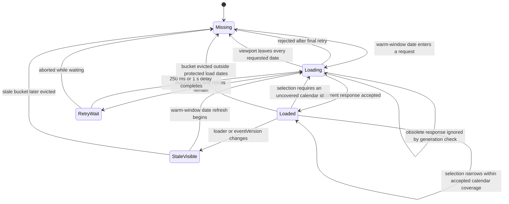
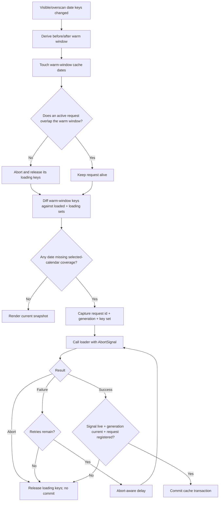
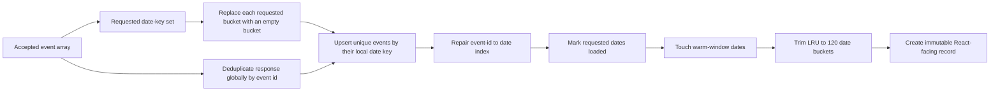
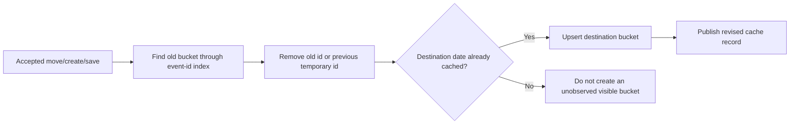
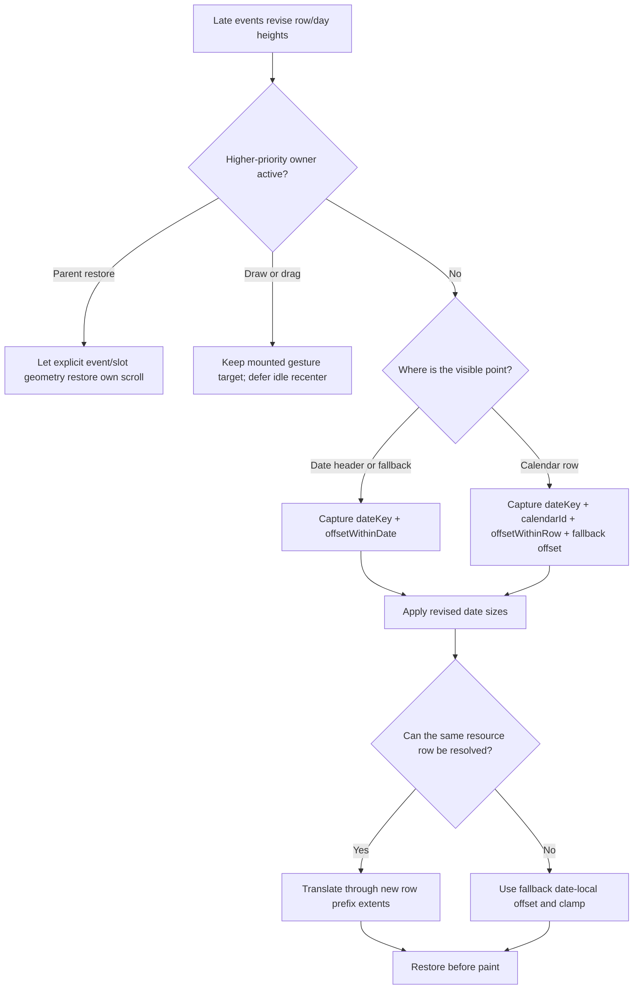

# Async Loading And Layout

The event API is additive to the calendar surface. Dates, resources, scrolling, hit-testing, zoom, and drafts render from settings, virtualization state, and the last accepted cache snapshot. None of them waits for `loadEvents`.

## End-To-End Delayed Load

```mermaid
sequenceDiagram
  actor User
  participant View as Calendar viewport
  participant Window as Virtual date window
  participant Hook as Range loader hook
  participant Coordinator as Range coordinator
  participant API as Async API
  participant Cache as Date/event cache
  participant Layout as Prepared-cell engine
  participant Measure as Day measurement bridge

  User->>View: Navigate or scroll to date D
  View->>Window: Render D from base/known date geometry
  Window-->>Hook: Visible and overscan date keys
  Hook->>Hook: Apply prefetch policy to build warm window
  Hook->>Coordinator: Update load dates; ask for missing ranges
  Coordinator-->>Hook: Contiguous keys not loaded or already loading
  Hook->>Coordinator: Begin each missing range in current generation
  Hook->>API: loadEvents(missing range, calendarIds, signal)
  Note over View,API: Grid, labels, zoom, hit-testing, drag, and draft creation remain live
  API-->>Hook: Events resolve later
  Hook->>Coordinator: Accept only if request is current
  alt Aborted, obsolete generation, or no rendered change
    Coordinator-->>Hook: Ignore snapshot commit
  else Current response changes cache
    Coordinator->>Cache: Replace requested buckets, deduplicate, touch, and trim
    Cache-->>Coordinator: Accepted bounded snapshot
    Hook->>Hook: startTransition(setEventsByDate)
    Hook-->>Layout: Revised date events
    Layout->>Layout: Membership, intervals, overlap lanes, row metrics
    Layout-->>View: Event shells and revised row/day heights
    View->>Measure: Resize affected virtual dates
    Measure->>View: Restore semantic date/resource focus when required
  end
```

The response is indexed into the bounded cache before it becomes React state. Prepared-cell layout then reads the committed snapshot; React rendering does not coordinate requests or mutate the cache.

While a controlled draft is active, participant filtering may make horizontal days shorter and expose more virtual
date nodes. Event loading retains the last non-draft warm window instead of treating that geometry-only expansion as
new navigation, then unions policy windows around the draft date and the explicit virtual-window anchor. A genuinely moved draft
or viewport navigation still loads its destination without prefetching a transient extra date at the lower edge.

## Date Request State

Loaded knowledge and rendered cache content are deliberately different concepts. Invalidating knowledge makes a date eligible for refresh; it does not erase the cached bucket that is currently on screen. Each loaded date also records the calendar ids covered by its accepted response. A selected subset remains fresh when that coverage contains every requested calendar id.



`StaleVisible` means the old bucket is still rendered while the date is no longer considered freshly loaded.

## Request And Cancellation Decision



Cancellation is an optimization and a resource boundary, not the correctness boundary. The generation and request-registration checks reject stale results even when an API client ignores `signal`.

## Cache Commit Transaction



Empty requested buckets are meaningful: a successful empty response records that those dates are loaded. A failed or aborted response never replaces the rendered buckets with emptiness.

Targeted moves and visible commits take a shorter path:



## Late Events That Increase Horizontal Height

Before the API resolves, an unloaded horizontal date uses compact base row heights. After loaded overlaps are prepared, only dense date/resource rows grow; availability and draft/preview overlays do not contribute lanes.

### What Stays In Focus?

The calendar preserves the semantic location that was visible before the metric commit. It does not focus the first newly loaded event.



Concrete cases:

| Situation                                | Preserved visual focus                             | Growth direction                                                            |
| ---------------------------------------- | -------------------------------------------------- | --------------------------------------------------------------------------- |
| `scrollToDate(D)` while D is unloaded    | D’s date header and local date offset              | Dense rows expand below the header.                                         |
| Viewport is inside resource R on D       | D, resource R, and the pixel offset inside R       | Rows above R are compensated; R keeps its local point; later rows move.     |
| The anchored row itself grows            | Its top plus the previous local offset             | The row gains height below its top while the saved local pixel stays fixed. |
| An explicit event/slot restore is active | Its captured viewport-relative point               | The automatic data-layout anchor yields.                                    |
| The anchored resource disappears         | D plus the saved fallback offset, clamped inside D | No unrelated resource is selected as a replacement.                         |
| User starts a new manual scroll          | The user’s new position                            | Scheduled correction is cancelled or superseded.                            |

For horizontal `scrollToDateTime`, vertical focus follows the date/resource policy while the requested time remains on the horizontal time axis.

## Orientation Differences

| Concern                               | Infinite horizontal                                        | Infinite vertical                                                                                                           |
| ------------------------------------- | ---------------------------------------------------------- | --------------------------------------------------------------------------------------------------------------------------- |
| Time axis                             | X                                                          | Y                                                                                                                           |
| Resource axis inside a date           | Variable-height rows                                       | Variable-width columns                                                                                                      |
| Late overlap metric                   | Can increase row height and total date height              | Can increase column width; date/time height remains determined by settings and zoom                                         |
| Primary scroll focus after event load | Date header or date/resource/local-row offset              | Date/time remains stable because event data does not change day height                                                      |
| Cross-axis identity                   | Calendar row id is restored when horizontal heights change | Calendar column id is the semantic cross-axis identity; this change does not add a separate automatic width-correction pass |
| Availability/draft/preview effect     | Overlay only; no row-height growth                         | Overlay only; no column-width growth                                                                                        |

## Runtime Invalidation Matrix

| Trigger                                     | Recomputed or updated                                                                        | Must remain stable                                                    |
| ------------------------------------------- | -------------------------------------------------------------------------------------------- | --------------------------------------------------------------------- |
| Visible date keys or prefetch policy change | Warm-window derivation, missing-range diff, request sets, load-window LRU protection         | Existing fresh cache buckets and grid DOM                             |
| Current API response                        | Requested buckets, membership for revised dates, prepared cells, affected row/column metrics | Settings, unrelated dates, pointer state                              |
| `eventVersion` or loader changes            | Request generation and loaded-date/calendar coverage knowledge                               | Rendered stale cache until replacement arrives                        |
| Selected ids change                         | Coverage diff; request only when a selected id is not already covered                        | Covered cache snapshot and rendered event DOM                         |
| Active-draft filtering changes visible keys | Retained settled warm window plus draft/navigation-anchor policy windows                     | Loader calls caused only by transient day-height contraction          |
| Accepted move/create/visible commit         | Indexed source/destination buckets and affected cells                                        | Loader call count and unrelated buckets                               |
| Horizontal zoom only                        | Time projection pixels and event-shell geometry                                              | Cache, memberships, overlap lanes, row metrics, external card content |
| Vertical zoom only                          | Time projection pixels and virtual day height                                                | Cache, memberships, overlap lanes, column metrics                     |
| Scroll                                      | Visible snapshot, virtual items, local resource subscribers                                  | Event cache and prepared cells                                        |
| Hover                                       | One resource-local rendered instance                                                         | Multi-calendar sibling instances and cache                            |

## Failure And Cancellation Subflows

### Failed loader

The loader retries after 250 ms and 1 second. The last accepted snapshot stays visible during both delays. After the final failure, loading ownership is released so a later visibility change or invalidation may request the date again.

### Never-resolving loader

The calendar surface stays interactive. If the request stops overlapping the active warm window, the coordinator aborts it and releases its loading keys. A loader that ignores abort may eventually resolve, but its request is no longer current and cannot commit.

### Out-of-order responses

Every request carries a generation, id, and calendar-id set. Loader or `eventVersion` changes advance the generation and abort registered requests. A selection change retains requests that cover the next subset and aborts incompatible ones. An older response fails the current-request predicate before touching rendered state.

### Empty response

A successful empty response writes empty buckets for the requested dates and marks them loaded. It does not alter date/resource geometry because loading UI is not rendered inside rows or columns.

### React transition delay

The cache coordinator may already hold the accepted result while React defers the snapshot transition. Rendering continues from the previous `eventsByDate` object until the transition commits atomically.

## Source Map

- `src/lib/timeline/infinite/events/loading/useEventRangeLoader.ts`: React async boundary and snapshot publication.
- `src/lib/timeline/infinite/events/loading/eventRangeCoordinator.ts`: request generations, loaded/loading knowledge, and request ownership.
- `src/lib/timeline/infinite/events/loading/eventDateCache.ts`: date buckets, event-id index, and LRU.
- `src/lib/timeline/infinite/events/loading/loadEventRange.ts`: retry and abort-aware delay.
- `src/lib/timeline/infinite/events/metrics/useDayMetrics.ts`: horizontal membership, preparation, and row/day metrics.
- `src/lib/timeline/infinite/anchors/data-layout/useHorizontalDayMeasurement.ts`: virtualizer sizing and automatic horizontal data-layout focus.
- `src/lib/timeline/infinite/events/metrics/useVerticalPreparedColumns.ts`: vertical membership, preparation, and width metrics.

The complete ownership map is in the [events domain](../domains/events.md) and
[anchors domain](../domains/anchors.md).
