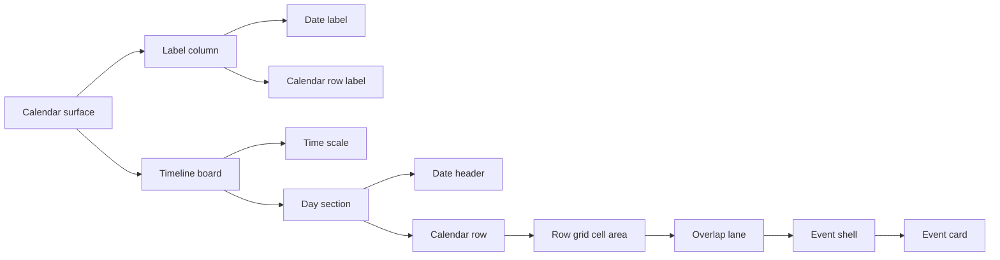

# Interface Taxonomy

This document defines the names used for visible calendar interface parts and the matching implementation concepts. Use these terms in code comments, docs, tests, and issue descriptions.

## Calendar Surface

| Term                         | Meaning                                                                                              | Implementation reference                          |
| ---------------------------- | ---------------------------------------------------------------------------------------------------- | ------------------------------------------------- |
| Calendar surface             | The whole reusable calendar component area, excluding demo sidebar controls.                         | public `CalendarRoot`; internal orientation views |
| View                         | A swappable calendar presentation inside `CalendarRoot`.                                             | `view`                                            |
| Infinite horizontal timeline | The view where dates flow vertically, calendars render as rows, and time flows horizontally.         | `view="infinite-horizontal"`                      |
| Infinite vertical timeline   | The view where dates and time flow vertically, while calendars render as columns from left to right. | `view="infinite-vertical"`                        |
| Infinite timeline            | Legacy shorthand for the infinite horizontal timeline.                                               | `view="infinite"`                                 |
| Viewport                     | The scrollable calendar area. It owns vertical scrolling and horizontal timeline scrolling.          | `.ic-viewport`                                    |
| Timeline board               | The scrollable grid area to the right of labels, including the time scale and row grids.             | `.ic-time-header`, `.ic-row-grid`                 |
| Label column                 | The sticky left column that contains date labels and calendar row labels.                            | `.ic-left-label`                                  |

## Axes And Headers

| Term                   | Meaning                                                                                                                                            | Implementation reference                                                        |
| ---------------------- | -------------------------------------------------------------------------------------------------------------------------------------------------- | ------------------------------------------------------------------------------- |
| Date sequence          | The virtual vertical list of included dates. Excluded weekdays are removed from this sequence.                                                     | date virtualization helpers                                                     |
| Day section            | One rendered virtual date, including its date header and calendar rows.                                                                            | `InfiniteTimelineDay`, `[data-testid="calendar-day"]`                           |
| Date header            | The sticky row that labels a day. Its left cell contains the date label, and its right side continues the gray day band across the timeline board. | `.ic-day-header`                                                                |
| Date label             | The left sticky text cell inside a date header, for example `July 6th, Monday`.                                                                    | `.ic-date-label`                                                                |
| Vertical date label    | The smaller two-line date label used by the infinite vertical timeline, with month/day above weekday.                                              | `.icv-date-label`, `.icv-date-main`, `.icv-date-weekday`                        |
| Time scale             | The single sticky top header that shows hour/minute labels. It is not repeated for every day.                                                      | `TimeScaleHeader`, `.ic-time-scale-header`                                      |
| Time label             | A visible number in the time scale, such as `9`, `15`, or `30`. Minute labels may render as superscript.                                           | `.ic-time-tick`                                                                 |
| Timeline grid line     | A vertical line aligned to a time interval. The cadence changes with zoom.                                                                         | `.ic-row-grid` background                                                       |
| Timeline gutter        | The small left padding before the first grid line, used so time labels and availability blocks do not touch the label border.                      | `TIMELINE_LEFT_GUTTER_PX`                                                       |
| Current-time marker    | The red tracking marker for the current system time. It includes the top pin, header segment, day-header band segments, and body lines.            | `.ic-now-pin`, `.ic-now-header-line`, `.ic-now-day-header-line`, `.ic-now-line` |
| Time pane              | The sticky left time-label area used by the infinite vertical timeline. Hour labels use `H:00`; minute labels use minute numbers.                  | `.icv-time-pane`                                                                |
| Vertical time grid     | The vertical timeline board inside one date section in the infinite vertical timeline.                                                             | `.icv-day-board`, `.icv-calendar-column-grid`                                   |
| Vertical sticky header | The per-day top-sticky header that labels the date and selected calendar columns in the infinite vertical timeline.                                | `.icv-day-header`                                                               |
| Calendar column header | The sticky header cell naming a calendar column in the infinite vertical timeline. It shares the column width for the same date/calendar.          | `.icv-calendar-header-cell`                                                     |

## Rows And Lanes

| Term               | Meaning                                                                                                                                                                                                                                   | Implementation reference                              |
| ------------------ | ----------------------------------------------------------------------------------------------------------------------------------------------------------------------------------------------------------------------------------------- | ----------------------------------------------------- |
| Calendar           | A selectable resource row, such as a doctor, room, surgery, or intake desk.                                                                                                                                                               | `CalendarRow`                                         |
| Selected calendar  | A calendar whose row is rendered for each visible day.                                                                                                                                                                                    | `selectedCalendarIds`                                 |
| Calendar row       | One horizontal resource row inside one day section. There is one row per selected calendar per day.                                                                                                                                       | `InfiniteTimelineRow`, `[data-testid="calendar-row"]` |
| Calendar row label | The sticky left cell naming the calendar row, for example `Room 201`.                                                                                                                                                                     | `.ic-row-label`                                       |
| Row grid cell area | The interactive timeline space inside a calendar row. Event creation and moves start only here.                                                                                                                                           | `.ic-row-grid`                                        |
| Row height         | The full height of one calendar row. It starts compact and grows locally when overlap density requires it.                                                                                                                                | `rowHeightForEvents`                                  |
| Calendar column    | One vertical resource column inside one day section in the infinite vertical timeline.                                                                                                                                                    | `[data-testid="calendar-column"]`                     |
| Column width       | The rendered width of a calendar column. It starts at `settings.verticalColumnMinWidth`, fits `settings.verticalColumnOverlapCapacity` parallel events, then grows by `settings.verticalColumnOverlapGrowth` per additional overlap lane. | `columnWidthForEvents`                                |
| Overlap lane       | A mini-lane inside a calendar row used to separate overlapping event shells at rest.                                                                                                                                                      | `lane`, `laneCount`                                   |
| Lane slot          | The vertical allocation for one overlap lane. Dense rows keep each slot at least 24px.                                                                                                                                                    | `laneHeight`                                          |
| Resting shell gap  | The 2px top and 2px bottom inset inside a lane slot, so neighboring resting event shells do not touch.                                                                                                                                    | `layoutEventsForRow`                                  |

## Events And Availability

| Term                 | Meaning                                                                                                                                                                       | Implementation reference            |
| -------------------- | ----------------------------------------------------------------------------------------------------------------------------------------------------------------------------- | ----------------------------------- |
| Calendar event       | The data object returned by `loadEvents`. It may represent an appointment, availability, or another product-specific block.                                                   | `CalendarEvent`                     |
| Event version        | Parent-controlled invalidation token for the loaded visible-range cache. Bump it after persisted event-store changes that should be reloaded through `loadEvents`.            | `eventVersion`                      |
| Appointment          | A normal timed event that users move/create in `events` interaction mode.                                                                                                     | `kind` omitted or product-specific  |
| Availability         | A background schedulable interval, usually full row height, shown with `kind: "availability"`.                                                                                | `kind: "availability"`              |
| Multi-calendar event | One event that belongs to more than one calendar and renders once in each matching selected calendar row.                                                                     | `calendarIds`                       |
| Event shell          | The calendar-owned positioned wrapper that controls geometry, hover size, z-index, and CSS variables.                                                                         | `EventShell`, `.ic-event-shell`     |
| Event card           | The product-owned visual content rendered inside an event shell. The demo card is only one possible renderer.                                                                 | `eventRenderer`, `.demo-event-card` |
| Availability shell   | An event shell used for an availability event. It is pointer-transparent in event mode and active in availability mode.                                                       | `.ic-availability-shell`            |
| Draft                | A temporary event shown while the user draws a new time range.                                                                                                                | `draft-new-event`, `status="new"`   |
| Active draft         | A parent-owned create or edit preview rendered while an external popup is open. Create active drafts render as `new`; edit active drafts replace their source event visually. | `activeDraft`                       |
| Exiting draft        | A released active draft shell retained briefly after parent state clears so cancellation can fade out without losing the visual anchor.                                       | `releaseActiveDraft`, `.is-exiting` |
| Viewport anchor      | An opaque library-owned snapshot that lets parent UI preserve a rendered event or calendar slot across parent state changes.                                                  | `CalendarViewportAnchor`            |
| Active draft move    | A drag proposal for the controlled active draft. The parent applies it to popup state instead of persisting loaded data.                                                      | `onActiveDraftMoveRequest`          |
| Drag preview         | A temporary shell showing the proposed event position during drag/drop.                                                                                                       | `status="drop-preview"`             |

## Interaction Terms

| Term                     | Meaning                                                                                                                                                          | Implementation reference                     |
| ------------------------ | ---------------------------------------------------------------------------------------------------------------------------------------------------------------- | -------------------------------------------- |
| Interaction mode         | The active editing layer: `events` or `availability`.                                                                                                            | `interactionMode`                            |
| Events mode              | Appointments are interactive. Availability is background context.                                                                                                | `interactionMode="events"`                   |
| Availability mode        | Availability blocks are interactive. Appointments are inactive background context.                                                                               | `interactionMode="availability"`             |
| Hovered event            | The single row-local event instance currently focused by pointer position. Multi-calendar siblings do not all hover.                                             | `status="hovered"`                           |
| Dragging event           | The original event instance during pointer drag. Multi-calendar siblings share drag status by event id.                                                          | `status="dragging"`                          |
| Drop proposal            | The snapped date, time range, and calendar membership proposed by a drag.                                                                                        | `buildMoveProposal`                          |
| Creation draft           | The snapped date, time range, calendar, and kind proposed by drawing on the row grid.                                                                            | `buildDraftEvent`                            |
| Draft request            | The parent callback payload for opening an external create flow from a drawn range.                                                                              | `onEventDraftRequest`                        |
| Event activation         | The parent callback payload for opening an external edit flow from an existing rendered event.                                                                   | `onEventActivate`                            |
| Draft drag               | Moving the currently controlled active draft while a popup is open. Drawing new ranges is blocked during this state.                                             | `onActiveDraftMoveRequest`                   |
| Parent validation        | The parent callback that accepts or rejects moves and creates.                                                                                                   | `onEventMoveRequest`, `onEventCreateRequest` |
| Snap interval            | The minute increment used for drag and draw interactions.                                                                                                        | `settings.snapMinutes`                       |
| Zoom                     | Pixels-per-minute scale for the timeline axis.                                                                                                                   | `settings.zoom`                              |
| Nearest-node zoom anchor | `Shift` + wheel behavior that keeps the rendered time-grid node nearest the mouse visually fixed while zoom changes.                                             | `onZoomChange`                               |
| Viewport-fill zoom floor | A horizontal render-scale floor that lets the timeline board fill the available viewport width after sticky labels without changing the parent-owned zoom value. | `settings.zoom`                              |

## Renderer Statuses

| Status         | Meaning                                                                              |
| -------------- | ------------------------------------------------------------------------------------ |
| `existing`     | Persisted event at rest.                                                             |
| `hovered`      | Row-local focused event. The shell expands and the renderer may reveal more content. |
| `dragging`     | Original event while a drag is active.                                               |
| `drop-preview` | Proposed drag/drop position rendered as a preview.                                   |
| `new`          | Creation draft rendered while drawing or immediately after create if needed.         |

## Preferred Language

- Use `calendar row` for the resource row inside a day. Avoid calling it a lane.
- Use `overlap lane` only for mini-lanes inside a calendar row.
- Use `event shell` for calendar-owned geometry and `event card` for product-owned renderer content.
- Use `date header` for the gray sticky day band and `date label` for its left text cell.
- Use `time scale` for the sticky top header and `time label` for individual numbers.
- Use `availability` for schedulable background intervals, not `free time` or `working hours`, unless product copy explicitly requires those words.

## Visual Map

