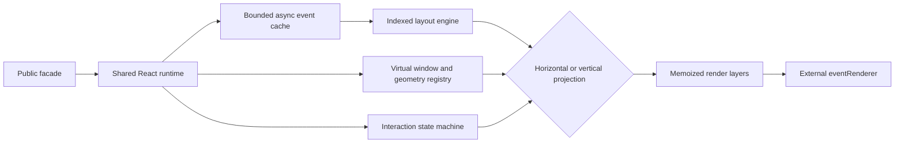

# Calendar V2 Rewrite Plan

## Outcome

Rewrite the calendar internals as one compatible cutover. Keep `CalendarRoot`, the package exports, both timeline orientations, controlled zoom, external event rendering, drag/create flows, availability, multi-calendar semantics, viewport anchoring, all examples, and all demo routes.

The implementation targets 50 selected resources and 20,000 total events per year in current Chromium, Firefox, and WebKit. Network latency must never block the calendar surface or its interactions.

## Implementation status

- [x] Bounded stale-while-refresh cache, cancellation/generation safety, retries, and indexed patches.
- [x] Membership index and deterministic prepared-cell layout shared by sizing and projection.
- [x] Cross-axis resource windows with overscan and draft/preview pinning.
- [x] Instance geometry registry, scheduled anchor restoration, Pointer Events, and split zoom controllers.
- [x] Native library date helpers and SSR-safe explicit stylesheet packaging.
- [x] Declarative demo routes, preset shells, focused controls, and delayed API example.
- [x] Final render/view decomposition, performance guardrails, package-consumer checks, and release gates.
- [x] Full Chromium suite and critical WebKit async, virtualization, sticky, zoom, drag/create, navigation, and anchoring matrix.
- [x] Zoom follow-up: continuous slider anchoring, stable prepared cells, and renderer-content isolation from shell geometry.
- [x] Late-data focus follow-up: semantic date/resource/local-row anchoring, dense delayed-load examples, and decomposed runtime flow guides.
- [x] Responsibility-domain follow-up: source organized into scroll, events, anchors, interactions, rendering, and views with bidirectional domain documentation.
- [x] Demo async-API follow-up: a local abortable HTTP mock endpoint, visible pending/idle status, a 1-second default, and selectable instant, 250ms, 1s, and 3s responses.
- [x] Demo separation follow-up: library-only `src/`, top-level demo application, one documented folder per focused example, public-package imports, and architecture enforcement.
- [ ] Run the critical Firefox matrix on a host where Playwright Firefox can initialize its compositor. This macOS host stalls before test execution with `RenderCompositorSWGL failed mapping default framebuffer` in both headless and headed modes.

## Verification snapshot — 2026-07-18

- Chromium: 64/64 Playwright tests passed, including selectable delayed API loading, unloaded-date rendering, and late-height viewport anchoring.
- WebKit: 30/30 critical Playwright tests passed; the focused async, core, examples, navigation, and vertical matrix passed 23/23 sequentially, plus the selectable delayed-demo scenario passed 1/1.
- Unit and performance: 128/128 Vitest tests passed across 28 files.
- Static checks: TypeScript, ESLint, Prettier, architecture budgets, and the production demo build passed.
- Layout scaling: the 10x input benchmark remains below the 25x execution-time ceiling.
- Architecture: all 104 production modules stay at or below 200 non-comment lines and every function at or below 120 source lines; 109 TypeScript, TSX, and runtime CSS files have verified domain ownership and backlinks.
- Demo boundary: `src/` contains reusable library code only; all six focused recipes have a dedicated guide, source backlink, and public-package import verified by the architecture gate.
- Package: isolated packed React consumer, TypeScript, Vite, Node ESM, CommonJS, SSR, declarations, and explicit CSS export passed.
- Bundle: ESM 27.86 KiB gzip (32 KiB limit); CSS 1.45 KiB gzip (2 KiB limit).

## Non-negotiable invariants

- The grid, dates, resources, scrolling, zoom, drag, and draft creation render without awaiting `loadEvents`.
- Cached events remain visible while a request is delayed or refreshed; loading UI never changes geometry.
- Aborted, rejected, and out-of-order responses cannot overwrite a newer query.
- Event responses update only affected date/resource cells. Exact date navigation preserves the date header; mid-date horizontal scrolling preserves the visible date/resource/local-row point, with a date-local fallback.
- Product card content remains external through `eventRenderer`.
- Native CSS sticky positioning remains the default for labels and headers.
- Zoom remains controlled by `settings.zoom`; gestures request changes through `onZoomChange`.
- Hit-testing stays inside timeline grid space.
- Multi-calendar hover remains instance-local, while drag and preview state remains keyed by event id.

## Target architecture

The implemented ownership tree and every source module are catalogued in [`docs/domains`](./docs/domains/README.md). Execution sequences remain in [`docs/flows`](./docs/flows/README.md).

### Public facade

- Keep the existing exports, view aliases, callback contracts, renderer statuses, imperative handle, React peer range, and `quno-calendar/styles.css` path.
- Split public contracts by responsibility internally and re-export them from the unchanged package entrypoint.
- Add only `signal?: AbortSignal` to `LoadEventsArgs`; existing async loaders remain compatible.
- Normalize the flat public `TimelineSettings` into internal common, horizontal, and vertical configuration.

### Async data engine

- Maintain an event index keyed by date, calendar membership, kind, and event id.
- Use a 120-date LRU cache, protecting visible dates and active draft/anchor dates from eviction.
- Coalesce contiguous missing ranges, prioritize visible dates over overscan, and cancel obsolete requests where the loader honors the supplied signal.
- Keep a generation guard for loaders that ignore cancellation.
- Preserve stale visible buckets during selection and version refreshes.
- Retry a failed visible request after 250 ms and 1 second, then leave it retryable on the next query or visibility invalidation.
- Merge, move, create, and commit through indexed buckets rather than scanning all cached dates.
- Prepare response commits in a React transition so network completion does not enter the pointer or scroll critical path.

### Layout and projection engine

- Compute membership, availability separation, overlap lanes, metrics, and event rectangles once per revised date/resource cell.
- Use deterministic `O(n log n)` overlap assignment and reuse prepared geometry for row height, column width, hit-testing, hover, and rendering.
- Keep a shared projection contract for time-to-pixel conversion, point-to-hit conversion, resource extent, anchor geometry, and date/time navigation.
- Implement explicit horizontal and vertical projections without hiding orientation-specific rendering behind condition-heavy generic components.

### Viewport and interaction runtime

- Keep bounded date virtualization with five-date overscan on each side and exact intra-day offset restoration.
- Render resource cells only for the visible cross-axis window, two-resource overscan on each side, and pinned draft resources while preserving full spacer geometry.
- Replace global selectors and retry ladders with an instance-scoped geometry registry for days, resources, and event instances.
- Batch DOM reads and scroll writes through one cancellable scheduler driven by layout and recenter epochs.
- Replace duplicate mouse/pointer pathways with one delegated Pointer Events controller.
- Model pressing, drawing, dragging, validating, controlled-draft dragging, release, cancellation, and callback failure as explicit transitions.
- Keep hover state local to the affected row or column and memoize prepared dates, resources, layers, and event shells.
- Give late horizontal metric commits their own one-commit data-layout anchor instead of relying on generic virtual-item resize compensation.

### Rendering and styles

- Split each resource cell into availability, committed event, draft, and drop-preview layers over one prepared geometry model.
- Preserve event CSS variables and visual behavior while treating internal class names as implementation details.
- Split shared tokens, event shell rules, horizontal layout, and vertical layout by ownership.
- Remove `date-fns` from runtime output in favor of tested local-date helpers, `Intl`, and a small ordinal formatter while preserving displayed labels and callback timestamp behavior.

## Module and documentation rules

- Target 40-150 lines for production modules; fail architecture checks above 200 non-comment lines or 120 lines per function.
- Enforce acyclic dependency direction between foundation, scroll, events, interactions, anchors, rendering, views, and the demo application.
- Put a short responsibility, input/output, invariant, and valid documentation link header on every non-trivial module.
- Keep the dependency overview in `docs/architecture.md`, ownership contracts and complete source maps in `docs/domains/`, and request, cache, layout, navigation, recenter, interaction, zoom, failure, and anchor execution sequences in `docs/flows/`.
- Verify that every runtime source file links to exactly one domain source map and that retired catch-all directories cannot return.
- Update `docs/architecture.md`, `docs/taxonomy.md`, `docs/usage.md`, `docs/decisions.md`, `docs/test-plan.md`, and `docs/changelog.md` in the same cutover. Reconcile stale project-brief and refactor-plan claims.

## Demo and examples

- Keep the five public examples as isolated, copyable recipes with only fixtures and a renderer shared between them.
- Replace manual route branching with a declarative registry.
- Replace duplicated demo variants with a shared shell plus small preset definitions.
- Keep dataset/loading, controls, rendering metrics, external-draft state, viewport anchoring, and popup presentation in focused demo-owned modules.
- Preserve every route, source link, test id, and product-specific renderer treatment.

## Verification and budgets

- Preserve every existing unit and Playwright behavior and remove current React `act(...)` and lint warnings.
- Add focused tests for normalization, date stepping, cache eviction/cancellation/races, targeted patches, overlap determinism, resource windows, projections, interaction transitions, geometry registration, anchor cancellation, and renderer memoization.
- Run the full browser suite in Chromium and sticky, scroll, zoom, drag/create, virtualization, and anchoring coverage in Firefox and WebKit.
- Add delayed, never-resolving, rejected, aborted, out-of-order, and large-response loaders. The calendar must stay interactive and must not blank. Dense delayed commits must preserve the exact date header or semantic date/resource/local-row anchor by no more than 1 px.
- At 1280x720 with 50 resources and 20,000 total events/year:
  - mounted dates are limited to visible dates plus ten overscan dates and one pinned anchor date;
  - mounted resources per date are limited to the visible range plus four overscan resources and pinned resources;
  - the cache never exceeds 120 date buckets;
  - calendar DOM stays below 5,000 nodes horizontally and 6,500 vertically, with at most 1,000 committed event shells;
  - pointer work produces at most one controller update per animation frame and does not rerender unaffected external cards;
  - p95 scripting and layout stays below 10 ms with no task over 50 ms;
  - a 10x layout benchmark increase stays below 25x execution time.
- Keep the ESM bundle at or below 32 KB gzip with a 30 KB target and CSS at or below 2 KB gzip.
- Verify ESM, require/SSR loading, the explicit stylesheet subpath, public declarations, and a packed React consumer.

## Scope assumptions

- Events retain the current same-day, Date-parsed timestamp model.
- Recurrence, explicit timezone selection, cross-midnight segmentation, and a full keyboard-grid accessibility redesign remain separate work.
- The scale target is 20,000 total events per year, not 20,000 events per resource.
